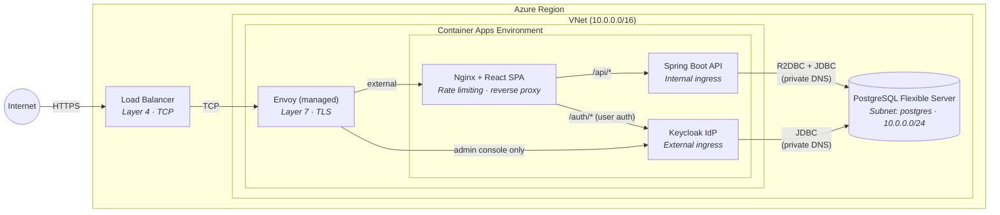
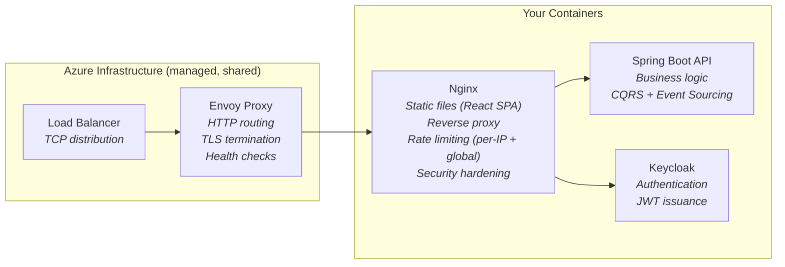

# Azure Deployment Guide

This guide walks you through deploying the **Expenses Tracker** application to **Azure** using:

- **Azure Container Apps** — for the backend API and frontend
- **Azure Database for PostgreSQL** — managed database
- **Azure Container Apps (Keycloak)** — identity provider

## Table of Contents

- [Architecture Overview](#architecture-overview)
- [Prerequisites](#prerequisites)
- [Configuration Variables](#configuration-variables)
- [Step 1: Install and Login to Azure CLI](#step-1-install-and-login-to-azure-cli)
- [Step 2: Create Azure Resources](#step-2-create-azure-resources)
- [Step 3: Create Azure Database for PostgreSQL](#step-3-create-azure-database-for-postgresql)
- [Step 4: Build and Push Docker Images](#step-4-build-and-push-docker-images)
- [Step 5: Deploy Keycloak](#step-5-deploy-keycloak)
- [Step 6: Deploy Backend API](#step-6-deploy-backend-api)
- [Step 7: Deploy Frontend](#step-7-deploy-frontend)
- [Step 8: Configure Keycloak Realm](#step-8-configure-keycloak-realm)
- [Step 9: Verify Deployment](#step-9-verify-deployment)
- [Update Existing Deployment](#update-existing-deployment)
- [Monitoring and Logs](#monitoring-and-logs)
- [Troubleshooting](#troubleshooting)
    - [Connect to PostgreSQL from Your Local Machine](#connect-to-postgresql-from-your-local-machine)
- [Cost Optimization](#cost-optimization)
- [Clean Up Resources](#clean-up-resources)

---

## Architecture Overview

### Traffic Flow (Internet → Application)



> **Note on inter-app traffic:** The arrows `Nginx → Spring` and `Nginx → Keycloak` are drawn
> directly for readability, but in Azure Container Apps *all* app-to-app traffic actually flows
> through the Environment's Envoy data plane. There is no direct pod-to-pod bypass — Nginx
> resolves Spring/Keycloak via their internal Container Apps FQDNs, and Envoy routes the request
> to the target replica. This applies even though all three apps share the same subnet.

### Component Responsibilities



**Key design decisions:**

- **Three reverse proxies** sit between the browser and the backend: Azure Load Balancer (Layer 4),
  Envoy (Layer 7, managed), and Nginx (Layer 7, yours). Each serves a distinct purpose — Azure LB
  distributes TCP connections, Envoy handles TLS/routing/health checks, Nginx serves the SPA and
  enforces rate limiting.
- **Azure Load Balancer** is fully managed by Azure and shared across the region's Container Apps
  infrastructure. It is **not exposed as a configurable resource** — you cannot see it in your
  resource group, tune its rules, or attach NSGs to it. It simply distributes inbound TCP
  connections to Envoy instances.
- **Envoy** is also managed by Azure, but unlike the Load Balancer it is **scoped to your Container
  Apps Environment** (one Envoy fleet per Environment). You don't edit Envoy config directly, but
  you *do* control its behavior through Container Apps settings — `external` vs `internal` ingress,
  target port, custom domains, TLS certificates, traffic splitting between revisions, and session
  affinity all translate into Envoy routing rules.
- The **frontend** (nginx) serves as the public entry point and reverse-proxies `/api/*` to the backend and `/auth/*` to
  Keycloak. Nginx enforces **per-IP and global rate limiting** — the backend has no application-level
  rate limiter (Nginx is the right place for HTTP-level rate limiting).
- The **backend API** uses internal ingress (not exposed to internet) — only reachable via the frontend proxy.
  It trusts `X-Forwarded-*` headers from Nginx to resolve the real client IP.
- **Keycloak** has external ingress for admin console access, but all user-facing authentication flows go through the
  frontend nginx proxy (`/auth/*`). Keycloak runs with context path `/auth` (`KC_HTTP_RELATIVE_PATH=/auth`) and a pinned
  `KC_HOSTNAME` pointing to the frontend proxy URL — this ensures consistent JWT issuer claims and prevents header
  spoofing.
- **PostgreSQL** is a managed Azure service, shared by the backend API and Keycloak

## Prerequisites

- **Azure Account**: [Create a free account](https://azure.microsoft.com/free/)
- **Azure CLI**: [Install Azure CLI](https://docs.microsoft.com/cli/azure/install-azure-cli)
- **Docker**: Already installed for local development
- **Built artifacts**:
  ```powershell
  # Build backend JAR
  .\gradlew.bat :expenses-tracker-api:bootJar

  # Build frontend (Docker will do this, but verify it works)
  cd expenses-tracker-frontend; npm run build; cd ..
  ```

## Configuration Variables

**⚠️ IMPORTANT**: Set these variables once at the beginning. All commands in this guide use these variables.

Copy and execute this entire block in your PowerShell terminal:

```powershell
# ====================================
# Azure Configuration Variables
# ====================================
# Customize these values for your deployment

# Azure Resource Configuration
$resourceGroup = "expenses-tracker-rg"
$location = "northeurope"  # Options: eastus, westeurope, northeurope, westus2, etc.

# Azure Container Registry (must be globally unique, lowercase, alphanumeric only, 5-50 chars)
$acrName = "yourexpensestracker"  # ⚠️ Change this to YOUR unique name

# Azure Container Apps
$envName = "expenses-tracker-env"
$apiAppName = "expenses-api"
$frontendAppName = "expenses-frontend"
$keycloakAppName = "expenses-keycloak"

# Networking (VNet integration — all resources share one VNet)
$vnetName = "expenses-tracker-rg-vnet"
$dbSubnetName = "postgres"                    # Delegated to PostgreSQL Flexible Server
$appsSubnetName = "container-apps"            # Used by Container Apps Environment (min /23)
$privateDnsZone = "expenses-tracker-db.private.postgres.database.azure.com"

# Database Configuration
$dbServerName = "expenses-tracker-db"  # Must be globally unique
$dbName = "expenses_db"
$dbAdminUser = "expensesadmin"
$dbAdminPassword = 'YourSecurePassword123!'  # ⚠️ Change this! Use SINGLE quotes — see note below.

# Keycloak Admin
$kcAdminUser = "admin"
$kcAdminPassword = 'KcAdminSecure456!'  # ⚠️ Change this! Use SINGLE quotes — see note below.

Write-Host "✅ Variables configured successfully!" -ForegroundColor Green
Write-Host "ACR Name: $acrName" -ForegroundColor Yellow
Write-Host "Resource Group: $resourceGroup" -ForegroundColor Yellow
Write-Host "Location: $location" -ForegroundColor Yellow
Write-Host "DB Server: $dbServerName" -ForegroundColor Yellow
```

**After running this block, you can copy-paste any command from this guide without modification!**

> **⚠️ PowerShell quoting gotcha for passwords:** Always wrap passwords in **single quotes** (`'...'`),
> not double quotes (`"..."`). In PowerShell, double quotes expand `$variable` references, so a
> password like `"*ZmVc$f2Ne"` gets silently truncated to `*ZmVc` (because `$f2Ne` is interpreted as
> an undefined variable and expands to empty). Single quotes are literal — no interpolation, no
> escaping — which is what you want for secrets. Quick sanity check after setting:
>
> ```powershell
> echo $dbAdminPassword   # should print the full password
> ```

## Step 1: Install and Login to Azure CLI

### Install Azure CLI

**Windows (Winget)**:

```powershell
winget install -e --id Microsoft.AzureCLI
```

**macOS**:

```bash
brew install azure-cli
```

**Linux (Ubuntu/Debian)**:

```bash
curl -sL https://aka.ms/InstallAzureCLIDeb | sudo bash
```

### Login to Azure

```powershell
# Standard login (opens browser)
az login

# If MFA required, use device code flow
az login --use-device-code
```

### Verify Subscription

```powershell
az account show
az account list --output table

# Set default subscription (if multiple)
az account set --subscription "Your Subscription Name"
```

---

## Step 2: Create Azure Resources

### Create Resource Group

```powershell
az group create --name $resourceGroup --location $location
```

### Create Azure Container Registry

```powershell
az acr create `
  --resource-group $resourceGroup `
  --name $acrName `
  --sku Basic `
  --admin-enabled true

az acr login --name $acrName
```

### Create Virtual Network and Subnets

All resources (PostgreSQL, Container Apps) share a single VNet for private communication.
Two subnets are needed: one delegated to PostgreSQL, one for Container Apps (minimum /23).

```powershell
# Create VNet with address space 10.0.0.0/16
az network vnet create `
  --resource-group $resourceGroup `
  --name $vnetName `
  --location $location `
  --address-prefix 10.0.0.0/16

# Subnet for PostgreSQL Flexible Server (delegated)
az network vnet subnet create `
  --resource-group $resourceGroup `
  --vnet-name $vnetName `
  --name $dbSubnetName `
  --address-prefix 10.0.0.0/24 `
  --delegations Microsoft.DBforPostgreSQL/flexibleServers

# Subnet for Container Apps Environment (min /23 = 512 addresses)
az network vnet subnet create `
  --resource-group $resourceGroup `
  --vnet-name $vnetName `
  --name $appsSubnetName `
  --address-prefix 10.0.2.0/23 `
  --delegations Microsoft.App/environments
```

> **Portal users:** If you created the PostgreSQL server via the Azure portal, the portal may have
> created the VNet with a narrow address space (e.g., `/24` instead of `/16`). The Container Apps
> subnet won't fit. Expand the VNet first:
> ```powershell
> # Check current address space
> az network vnet show --resource-group $resourceGroup --name $vnetName --query addressSpace.addressPrefixes -o tsv
>
> # If it shows 10.0.0.0/24, expand to /16
> az network vnet update --resource-group $resourceGroup --name $vnetName --address-prefixes 10.0.0.0/16
> ```
> Then retry the `az network vnet subnet create` command above.

### Create Private DNS Zone for PostgreSQL

```powershell
az network private-dns zone create `
  --resource-group $resourceGroup `
  --name $privateDnsZone

# Link the DNS zone to the VNet so containers can resolve the DB hostname
az network private-dns link vnet create `
  --resource-group $resourceGroup `
  --zone-name $privateDnsZone `
  --name "postgres-dns-link" `
  --virtual-network $vnetName `
  --registration-enabled false
```

### Create Container Apps Environment (VNet-integrated)

```powershell
$appsSubnetId = az network vnet subnet show `
  --resource-group $resourceGroup `
  --vnet-name $vnetName `
  --name $appsSubnetName `
  --query id -o tsv

az containerapp env create `
  --name $envName `
  --resource-group $resourceGroup `
  --location $location `
  --infrastructure-subnet-resource-id $appsSubnetId
```

This takes about 2–3 minutes. The Container Apps Environment is now deployed inside the VNet,
giving all containers private network access to PostgreSQL.

---

## Step 3: Create Azure Database for PostgreSQL

### Create Flexible Server (VNet-integrated)

The database is created with **private access** inside the VNet — no public endpoint, no firewall rules needed.
Only resources in the same VNet (Container Apps) can reach it.

```powershell
$dbSubnetId = az network vnet subnet show `
  --resource-group $resourceGroup `
  --vnet-name $vnetName `
  --name $dbSubnetName `
  --query id -o tsv

az postgres flexible-server create `
  --resource-group $resourceGroup `
  --name $dbServerName `
  --location $location `
  --admin-user $dbAdminUser `
  --admin-password $dbAdminPassword `
  --tier Burstable `
  --sku-name Standard_B1ms `
  --storage-size 32 `
  --version 17 `
  --subnet $dbSubnetId `
  --private-dns-zone $privateDnsZone `
  --yes
```

> **Note:** `Standard_B1ms` belongs to the **Burstable** tier, so `--tier Burstable` must be
> specified explicitly — the Azure CLI defaults `--tier` to `GeneralPurpose`, which rejects
> Burstable SKUs.

> **Note:** With private access, the database has **no public endpoint**. The server's FQDN
> (`$dbServerName.private.postgres.database.azure.com`) resolves only within the VNet via the
> private DNS zone. You cannot connect from your local machine — use `az containerapp exec`
> or a Container Apps Job (shown below) for administrative tasks.

### Create Database

```powershell
az postgres flexible-server db create `
  --resource-group $resourceGroup `
  --server-name $dbServerName `
  --database-name $dbName
```

### Create Keycloak Schema

Since the database has no public endpoint, we use a **Container Apps Job** to run SQL from inside
the VNet. This creates the `keycloak` schema that Keycloak requires:

```powershell
# Get the auto-generated hostname from the private DNS zone A record
$aRecordName = az network private-dns record-set a list `
  --resource-group $resourceGroup `
  --zone-name $privateDnsZone `
  --query "[0].name" -o tsv
$dbHost = "${aRecordName}.${privateDnsZone}"

# Generate a YAML definition for the job (avoids PowerShell quoting issues with --command/--args).
# IMPORTANT: Use YAML single quotes for the password value — single quotes preserve $ and other
# special characters literally. Double quotes in YAML treat \ and $ as escape sequences.
# Use [System.IO.File]::WriteAllText to avoid the UTF-8 BOM that PowerShell 5.1 adds — BOM corrupts YAML.
$yamlContent = @"
properties:
  configuration:
    triggerType: Manual
    manualTriggerConfig:
      parallelism: 1
      replicaCompletionCount: 1
    replicaTimeout: 300
    replicaRetryLimit: 1
  template:
    containers:
    - name: psql
      image: postgres:17-alpine
      command: ['/bin/sh', '-c', 'psql -h $dbHost -U $dbAdminUser -d $dbName sslmode=require -c "CREATE SCHEMA IF NOT EXISTS keycloak;"']
      env:
      - name: PGPASSWORD
        value: '$dbAdminPassword'
      resources:
        cpu: 0.25
        memory: 0.5Gi
"@
[System.IO.File]::WriteAllText("$PWD\db-init-job.yaml", $yamlContent)

az containerapp job create `
  --name "db-init" `
  --resource-group $resourceGroup `
  --environment $envName `
  --yaml db-init-job.yaml

# Start the job and wait for it to complete
az containerapp job start `
  --name "db-init" `
  --resource-group $resourceGroup

# Check execution status (wait ~60 seconds, then verify)
Start-Sleep -Seconds 60
az containerapp job execution list `
  --name "db-init" `
  --resource-group $resourceGroup `
  --output table

# Clean up the one-time job and temp file
az containerapp job delete `
  --name "db-init" `
  --resource-group $resourceGroup `
  --yes
Remove-Item db-init-job.yaml -ErrorAction SilentlyContinue
```

### Get Database Connection Details

Azure PostgreSQL Flexible Server with private access creates an A record with an **auto-generated
prefix** in the private DNS zone (e.g., `abc123.$dbServerName.private.postgres.database.azure.com`).
The bare zone name has no A record and won't resolve. Query the actual hostname:

```powershell
# Get the auto-generated hostname prefix from the private DNS zone A record
$aRecordName = az network private-dns record-set a list `
  --resource-group $resourceGroup `
  --zone-name $privateDnsZone `
  --query "[0].name" -o tsv

$dbHost = "${aRecordName}.${privateDnsZone}"
$dbJdbcUrl = "jdbc:postgresql://${dbHost}:5432/${dbName}?sslmode=require"
$dbR2dbcUrl = "r2dbc:postgresql://${dbHost}:5432/${dbName}?sslMode=require"

Write-Host "DB Host: $dbHost" -ForegroundColor Yellow
Write-Host "JDBC URL: $dbJdbcUrl" -ForegroundColor Yellow
Write-Host "R2DBC URL: $dbR2dbcUrl" -ForegroundColor Yellow
```

> **⚠️ Important:** Do **not** use `$dbServerName.private.postgres.database.azure.com` directly —
> that bare hostname has no A record in the private DNS zone. Azure auto-generates a unique prefix
> (e.g., `d93082ade025`) for the actual resolvable hostname. The command above retrieves it.

---

## Step 4: Build and Push Docker Images

### Build Backend

```powershell
# Build the Spring Boot JAR
.\gradlew.bat :expenses-tracker-api:bootJar

# Build Docker image
docker build -t expenses-api:latest ./expenses-tracker-api

# Tag and push to ACR
docker tag expenses-api:latest "$acrName.azurecr.io/expenses-api:latest"
docker push "$acrName.azurecr.io/expenses-api:latest"
```

### Build Frontend

The frontend nginx.conf references container names (`expenses-api`, `keycloak`) which won't work in Azure Container
Apps. We need a modified nginx.conf for Azure. Create it before building:

```powershell
# We'll update nginx.conf after we know the service URLs.
# For now, build and push the image — we'll handle nginx config in Step 7.
docker build -t expenses-frontend:latest ./expenses-tracker-frontend
docker tag expenses-frontend:latest "$acrName.azurecr.io/expenses-frontend:latest"
docker push "$acrName.azurecr.io/expenses-frontend:latest"
```

### Verify Images in ACR

```powershell
az acr repository list --name $acrName --output table
```

---

## Step 5: Deploy Keycloak

### Get ACR Credentials

```powershell
$acrPassword = az acr credential show --name $acrName --query "passwords[0].value" -o tsv
```

### Deploy Keycloak Container

We use a YAML file to deploy Keycloak because passwords containing `$` or `!` get mangled by
PowerShell's `--env-vars` argument parsing. YAML single quotes preserve special characters literally.

```powershell
# Generate YAML with env vars (single-quoted values preserve $ and ! in passwords)
$kcYaml = @"
properties:
  template:
    containers:
    - name: expenses-keycloak
      image: quay.io/keycloak/keycloak:26.2
      args: ["start"]
      env:
      - name: KC_DB
        value: postgres
      - name: KC_DB_URL
        value: '$dbJdbcUrl'
      - name: KC_DB_USERNAME
        value: '$dbAdminUser'
      - name: KC_DB_PASSWORD
        value: '$dbAdminPassword'
      - name: KC_DB_SCHEMA
        value: keycloak
      - name: KC_HTTP_RELATIVE_PATH
        value: /auth
      - name: KC_HTTP_ENABLED
        value: "true"
      - name: KC_HOSTNAME_STRICT
        value: "false"
      - name: KC_BOOTSTRAP_ADMIN_USERNAME
        value: '$kcAdminUser'
      - name: KC_BOOTSTRAP_ADMIN_PASSWORD
        value: '$kcAdminPassword'
      resources:
        cpu: 1.0
        memory: 2Gi
    scale:
      minReplicas: 1
      maxReplicas: 1
"@
[System.IO.File]::WriteAllText("$PWD\keycloak-app.yaml", $kcYaml)

az containerapp create `
  --name $keycloakAppName `
  --resource-group $resourceGroup `
  --environment $envName `
  --yaml keycloak-app.yaml

# Enable external ingress (YAML --yaml ignores --ingress flags)
az containerapp ingress enable `
  -n $keycloakAppName `
  -g $resourceGroup `
  --type external `
  --target-port 8080 `
  --transport auto

Remove-Item keycloak-app.yaml -ErrorAction SilentlyContinue
```

> **Note:** In production, Keycloak uses `start` (not `start-dev`).
> We intentionally omit `KC_HOSTNAME` here — it will be set after we get the Keycloak FQDN (below)
> and later updated to the frontend proxy URL in Step 7.
> `KC_HOSTNAME_STRICT=false` lets Keycloak boot without a pinned hostname on the very first
> startup (Keycloak 26 in `start` mode would otherwise fail with
> `hostname is not configured; either configure hostname, or set hostname-strict to false`).
> Once we pin `KC_HOSTNAME` in the next step, `KC_HOSTNAME_STRICT` becomes a no-op.
> `KC_HTTP_ENABLED=true` is needed because Azure Container Apps terminates TLS at the ingress level.
> `KC_HTTP_RELATIVE_PATH=/auth` sets the context path — all Keycloak endpoints are under `/auth/`.
>
> **⚠️ PowerShell & special characters:** The `--env-vars` CLI flag is processed by PowerShell before
> reaching Azure CLI. Characters like `$`, `!`, and `` ` `` in passwords get expanded or stripped.
> Using a YAML file with single-quoted values avoids this entirely.

### Get Keycloak URL

```powershell
$keycloakFqdn = az containerapp show `
  --name $keycloakAppName `
  --resource-group $resourceGroup `
  --query properties.configuration.ingress.fqdn -o tsv

$keycloakUrl = "https://$keycloakFqdn"
Write-Host "Keycloak URL: $keycloakUrl" -ForegroundColor Green
Write-Host "Admin Console: $keycloakUrl/auth/admin" -ForegroundColor Green
```

### Set Keycloak Hostname

Pin `KC_HOSTNAME` to the Keycloak external URL so the admin console works immediately.
This will be updated to the frontend proxy URL in Step 7.

```powershell
az containerapp update `
  --name $keycloakAppName `
  --resource-group $resourceGroup `
  --set-env-vars KC_HOSTNAME="$keycloakUrl/auth"
```

Wait for Keycloak to be ready (1–2 minutes), then open `$keycloakUrl/auth/admin` and log in with the admin credentials.

---

## Step 6: Deploy Backend API

### Deploy API Container

We create the app with `--secrets` inline (so the DB password is stored as a Container Apps
secret, not a plain env var) and reference it from env vars via `secretref:`.

```powershell
$keycloakJwkSetUri = "$keycloakUrl/auth/realms/expenses-tracker/protocol/openid-connect/certs"

az containerapp create `
  --name $apiAppName `
  --resource-group $resourceGroup `
  --environment $envName `
  --image "$acrName.azurecr.io/expenses-api:latest" `
  --target-port 8080 `
  --ingress internal `
  --registry-server "$acrName.azurecr.io" `
  --registry-username $acrName `
  --registry-password $acrPassword `
  --cpu 0.5 `
  --memory 1.0Gi `
  --min-replicas 1 `
  --max-replicas 3 `
  --secrets `
    db-password="$dbAdminPassword" `
  --env-vars `
    EXPENSES_TRACKER_R2DBC_URL="$dbR2dbcUrl" `
    EXPENSES_TRACKER_R2DBC_USERNAME="$dbAdminUser" `
    EXPENSES_TRACKER_R2DBC_PASSWORD=secretref:db-password `
    EXPENSES_TRACKER_FLYWAY_JDBC_URL="$dbJdbcUrl" `
    EXPENSES_TRACKER_FLYWAY_USERNAME="$dbAdminUser" `
    EXPENSES_TRACKER_FLYWAY_PASSWORD=secretref:db-password `
    KEYCLOAK_ISSUER_URI="PLACEHOLDER" `
    KEYCLOAK_JWK_SET_URI="$keycloakJwkSetUri" `
    CORS_ALLOWED_ORIGINS="PLACEHOLDER" `
    SYNC_FILE_PATH="/app/sync-data/sync.json" `
    SYNC_FILE_COMPRESSION_ENABLED=true
```

> **Note:** `--secrets` and `--env-vars` with `secretref:` can only be used together when the app
> is created (or updated) in a single call. Running `az containerapp secret set` on its own
> requires the app to already exist — that's why secret declaration is inlined here.
>
> **Note:** The API uses **internal ingress** — it's only accessible from within the Container Apps
> environment (via the frontend proxy). Not exposed to the internet.
>
> `KEYCLOAK_ISSUER_URI` is set to `"PLACEHOLDER"` for now because it must match the `iss` claim in
> browser-issued JWTs. Since browsers authenticate through the frontend nginx proxy (`/auth/*`),
> the issuer will be `https://$frontendFqdn/auth/realms/expenses-tracker` — but we don't know
> the frontend URL until Step 7. We'll update this at the end of Step 7.
>
> `CORS_ALLOWED_ORIGINS` is also a placeholder for the same reason: Spring's CORS filter must
> allow the browser's `Origin` header, which is the frontend URL we don't know yet. It will be
> filled in at the end of Step 7 alongside `KEYCLOAK_ISSUER_URI`.
>
> `KEYCLOAK_JWK_SET_URI` uses the Keycloak external URL directly (container-to-container call for
> fetching public keys) and can be set immediately.

### (Optional) Rotate the DB password later

Once the app exists, you can rotate the secret without recreating the app:

```powershell
az containerapp secret set `
  --name $apiAppName `
  --resource-group $resourceGroup `
  --secrets db-password="$newDbPassword"

# Force a new revision to pick up the rotated secret value
az containerapp update --name $apiAppName --resource-group $resourceGroup
```

### Get API Internal URL

```powershell
$apiFqdn = az containerapp show `
  --name $apiAppName `
  --resource-group $resourceGroup `
  --query properties.configuration.ingress.fqdn -o tsv

Write-Host "API Internal FQDN: $apiFqdn" -ForegroundColor Yellow
```

---

## Step 7: Deploy Frontend

The frontend nginx needs to know the internal hostnames of the API and Keycloak. In Azure Container Apps, services
within the same environment can communicate using their internal FQDNs.

### Create Azure-Specific nginx.conf

Create a file `nginx-azure.conf` in the project root:

```powershell
$apiFqdn = az containerapp show --name $apiAppName --resource-group $resourceGroup --query properties.configuration.ingress.fqdn -o tsv
$keycloakFqdn = az containerapp show --name $keycloakAppName --resource-group $resourceGroup --query properties.configuration.ingress.fqdn -o tsv

$nginxConf = @"
# =============================================================================
# Rate limiting zones
# =============================================================================
# Each zone = shared memory that tracks request counts.
# Key = what to count by. Rate = sustained limit. Burst (in `location`) = how
# many extra requests we'll absorb briefly before returning 429.
#
# See expenses-tracker-frontend/nginx.conf for the annotated local version.

# Per-IP zones — each client IP gets its own counter.
limit_req_zone `$binary_remote_addr zone=general_per_ip:10m rate=10r/s;
limit_req_zone `$binary_remote_addr zone=api_per_ip:10m     rate=5r/s;
limit_req_zone `$binary_remote_addr zone=auth_per_ip:10m    rate=3r/s;

# Global zones — single counter shared by ALL clients. These are a safety net
# for the backend even when individual clients stay within per-IP limits.
limit_req_zone `$server_name         zone=api_global:1m     rate=300r/s;
limit_req_zone `$server_name         zone=sync_global:1m    rate=10r/m;

server {
    listen 80;
    server_name localhost;

    root /usr/share/nginx/html;
    index index.html;

    # =========================================================================
    # Trust X-Forwarded-For from Azure's edge (Load Balancer + Envoy)
    # =========================================================================
    # By default `\$binary_remote_addr` equals the direct TCP peer, which in
    # Container Apps is Envoy — so every request would appear to come from the
    # same IP and per-IP rate limits would become "one global bucket".
    #
    # These directives tell nginx: "when a request arrives from a trusted
    # upstream, replace \$remote_addr with the real client IP extracted from
    # the X-Forwarded-For header".
    #
    #   set_real_ip_from 0.0.0.0/0   — trust any upstream. Safe here because
    #       the Container App only accepts traffic from Azure's managed
    #       Envoy/LB; there's no other path into port 80. If you later add
    #       direct ingress or a custom gateway, tighten this to Envoy's
    #       subnet.
    #   real_ip_header X-Forwarded-For  — the header Envoy sets.
    #   real_ip_recursive on  — walk the XFF chain right-to-left and skip
    #       trusted proxies, so the leftmost *untrusted* address is used
    #       (i.e., the real client).
    set_real_ip_from 0.0.0.0/0;
    real_ip_header X-Forwarded-For;
    real_ip_recursive on;

    # =========================================================================
    # Security hardening
    # =========================================================================
    server_tokens off;          # Hide "Server: nginx/1.x.x" from responses
    client_max_body_size   1m;  # Reject > 1 MB bodies with 413
    client_body_timeout    10s; # Slowloris mitigation (slow POST body)
    client_header_timeout  10s; # Slowloris mitigation (slow headers)

    # Sync endpoint (heavier work — stricter global limit).
    # Must appear BEFORE /api/ since nginx matches the longest prefix first.
    location /api/expenses/sync {
        limit_req zone=api_per_ip   burst=5 nodelay;
        limit_req zone=sync_global  burst=2 nodelay;
        limit_req_status 429;

        proxy_pass https://${apiFqdn};
        proxy_set_header Host $apiFqdn;
        proxy_set_header X-Real-IP         `$remote_addr;
        proxy_set_header X-Forwarded-For   `$proxy_add_x_forwarded_for;
        proxy_set_header X-Forwarded-Proto https;
        proxy_ssl_server_name on;
    }

    # Proxy API requests to the backend (internal ingress)
    location /api/ {
        limit_req zone=api_per_ip   burst=10 nodelay;
        limit_req zone=api_global   burst=15 nodelay;
        limit_req_status 429;

        proxy_pass https://${apiFqdn};
        proxy_set_header Host $apiFqdn;
        proxy_set_header X-Real-IP         `$remote_addr;
        proxy_set_header X-Forwarded-For   `$proxy_add_x_forwarded_for;
        proxy_set_header X-Forwarded-Proto https;
        proxy_ssl_server_name on;
    }

    # Proxy Keycloak auth requests (preserve /auth/ prefix — Keycloak context path)
    location /auth/ {
        limit_req zone=auth_per_ip  burst=5 nodelay;
        limit_req_status 429;

        proxy_pass https://${keycloakFqdn};
        proxy_set_header Host $keycloakFqdn;
        proxy_set_header X-Real-IP         `$remote_addr;
        proxy_set_header X-Forwarded-For   `$proxy_add_x_forwarded_for;
        proxy_set_header X-Forwarded-Proto https;
        proxy_ssl_server_name on;
    }

    # Proxy actuator requests to the backend (no rate limit — used by health probes)
    location /actuator/ {
        proxy_pass https://${apiFqdn};
        proxy_set_header Host $apiFqdn;
        proxy_ssl_server_name on;
    }

    # Serve static files; fall back to index.html for client-side routing
    location / {
        limit_req zone=general_per_ip burst=20 nodelay;
        limit_req_status 429;

        try_files `$uri `$uri/ /index.html;
    }

    # Cache static assets (Vite emits content-hashed filenames)
    location /assets/ {
        expires 1y;
        add_header Cache-Control "public, immutable";
    }
}
"@
# Use WriteAllText to avoid the UTF-8 BOM that PowerShell 5.1's Out-File adds — BOM corrupts nginx config.
[System.IO.File]::WriteAllText("$PWD\expenses-tracker-frontend\nginx-azure.conf", $nginxConf)
```

> **Rate limiting & hardening.** The config above mirrors the protections in
> `expenses-tracker-frontend/nginx.conf` (used by local Docker Compose):
>
> - **Real client IP resolution** (`set_real_ip_from` + `real_ip_header X-Forwarded-For`) is
    > essential on Azure. Without it, per-IP limits would treat every request as coming from Envoy
    > and collapse into a single global bucket. With it, nginx sees the actual browser IP that
    > Envoy forwarded in `X-Forwarded-For`.
> - **Per-IP limits** on `/api/`, `/auth/`, and the SPA (`/`) cap abuse from any single client.
> - **Global limits** on `/api/` and `/api/expenses/sync` protect the backend from total overload
    > even if many clients stay within their per-IP budget.
> - **`server_tokens off`** hides the exact nginx version from response headers.
> - **`client_max_body_size 1m`** rejects oversized request bodies with 413.
> - **`client_body_timeout` / `client_header_timeout`** mitigate slow-POST / Slowloris attacks.
> - **`limit_req_status 429`** returns the correct HTTP status when a client hits a limit
    > (nginx's default is 503).
> - Actuator is intentionally not rate-limited because Azure's health probe hits it every few
    > seconds.

> **Why `proxy_set_header Host $apiFqdn` (and not `$host`)?** Azure Container Apps routes requests
> through a shared Envoy proxy that dispatches to the right app **based on the `Host` header**.
> If nginx forwards the client's Host (`expenses-frontend...`), Envoy can't find a matching
> internal route and returns a 404. Setting Host to the upstream's internal FQDN tells Envoy which
> app to route the request to. The same rule applies to the Keycloak proxy block.
>
> **Why `proxy_pass https://...` for the internal API (not `http://`)?** Container Apps' internal
> ingress redirects HTTP to HTTPS (Envoy returns `301 Location: https://...internal...`). Because
> the internal FQDN is only reachable from inside the VNet, the browser can't follow that redirect.
> Proxying to `https://` from nginx directly avoids the redirect and keeps all traffic inside the
> Container Apps Environment. The `proxy_ssl_server_name on;` directive enables SNI, which the
> shared Envoy needs to select the correct TLS certificate for the target app.

### Build Frontend Image

```powershell
# Create a Dockerfile variant for Azure that uses the Azure nginx config.
# Use a single-quoted here-string (@'...'@) so PowerShell doesn't treat the
# backticks in the comments as escape characters.
$dockerfileContent = @'
FROM node:24-alpine AS builder
WORKDIR /app
COPY package.json package-lock.json ./
# Use `npm install` (not `npm ci`) so Linux-specific optional deps (@emnapi/*, @napi-rs/*)
# missing from a Windows-generated package-lock.json don't block the build.
RUN npm install --no-audit --no-fund
COPY . .
RUN npm run build

FROM nginx:stable-alpine
COPY --from=builder /app/dist /usr/share/nginx/html
COPY nginx-azure.conf /etc/nginx/conf.d/default.conf
EXPOSE 80
HEALTHCHECK --interval=30s --timeout=3s --start-period=10s --retries=3 \
  CMD wget --no-verbose --tries=1 --spider http://localhost:80/ || exit 1
'@
# Use WriteAllText to avoid BOM — same reason as nginx-azure.conf.
[System.IO.File]::WriteAllText("$PWD\expenses-tracker-frontend\Dockerfile.azure", $dockerfileContent)

# Build with an immutable timestamp tag so every push creates a new revision
$imgTag = (Get-Date -Format "yyyyMMdd-HHmmss")
docker build -f expenses-tracker-frontend/Dockerfile.azure -t "expenses-frontend:$imgTag" ./expenses-tracker-frontend
docker tag "expenses-frontend:$imgTag" "$acrName.azurecr.io/expenses-frontend:$imgTag"
```

### Push Frontend Image and Clean Up

```powershell
# ACR access tokens expire — refresh Docker's credentials before pushing
az acr login --name $acrName
docker push "$acrName.azurecr.io/expenses-frontend:$imgTag"

# Clean up local build artifacts — they're now baked into the pushed image
Remove-Item expenses-tracker-frontend/nginx-azure.conf, expenses-tracker-frontend/Dockerfile.azure -ErrorAction SilentlyContinue
```

> **Note on generated files:** `nginx-azure.conf` and `Dockerfile.azure` are build-time-only
> artifacts. Once the image is pushed to ACR, Container Apps pulls from there and the local
> files are no longer referenced. They contain environment-specific FQDNs, so they're listed
> in `.gitignore` and should not be committed. Regenerate them by re-running the snippets above
> when you need to rebuild the frontend image.

> **Note on `npm install` vs `npm ci`:** If your `package-lock.json` was generated on Windows,
> it won't contain the Linux-arch entries for optional deps like `@emnapi/core` and
> `@emnapi/runtime` (used transitively by `rollup` / `lightningcss`). `npm ci` is strict and
> fails in that case. `npm install` reconciles the lock file inside the container, which is
> acceptable for a throwaway build stage. Alternative: regenerate `package-lock.json` on Linux
> (e.g., inside WSL) and keep `npm ci`.
>
> **Note on `az acr login`:** ACR tokens expire (≈3 hours). If `docker push` fails with
> `authentication required`, re-run `az acr login --name $acrName` and push again.

### Deploy Frontend Container

```powershell
az containerapp create `
  --name $frontendAppName `
  --resource-group $resourceGroup `
  --environment $envName `
  --image "$acrName.azurecr.io/expenses-frontend:$imgTag" `
  --target-port 80 `
  --ingress external `
  --registry-server "$acrName.azurecr.io" `
  --registry-username $acrName `
  --registry-password $acrPassword `
  --cpu 0.25 `
  --memory 0.5Gi `
  --min-replicas 1 `
  --max-replicas 3
```

### Get Frontend URL

```powershell
$frontendFqdn = az containerapp show `
  --name $frontendAppName `
  --resource-group $resourceGroup `
  --query properties.configuration.ingress.fqdn -o tsv

$frontendUrl = "https://$frontendFqdn"
Write-Host "Frontend URL: $frontendUrl" -ForegroundColor Green
```

### Update Keycloak Hostname, API Issuer URI, and CORS

Keycloak's `KC_HOSTNAME`, the API's `KEYCLOAK_ISSUER_URI`, and the API's `CORS_ALLOWED_ORIGINS`
were all set to placeholders in Steps 5 and 6. Now that the frontend URL is known, update them:

```powershell
$keycloakIssuerUri = "https://$frontendFqdn/auth/realms/expenses-tracker"

# Pin Keycloak's public URL to the frontend proxy
az containerapp update `
  --name $keycloakAppName `
  --resource-group $resourceGroup `
  --set-env-vars KC_HOSTNAME="https://$frontendFqdn/auth"

# Set the API's issuer URI and CORS origin to match the frontend proxy
az containerapp update `
  --name $apiAppName `
  --resource-group $resourceGroup `
  --set-env-vars `
    KEYCLOAK_ISSUER_URI="$keycloakIssuerUri" `
    CORS_ALLOWED_ORIGINS="$frontendUrl"
```

> **Why pin `KC_HOSTNAME`?** With a pinned hostname, Keycloak ignores forwarded headers and always
> generates URLs with the frontend proxy origin. This prevents header-spoofing attacks and ensures
> JWT `iss` claims are consistent regardless of how Keycloak is accessed (via Nginx proxy or
> directly via its external ingress for admin). The API's `KEYCLOAK_ISSUER_URI` must match.
>
> **Why `CORS_ALLOWED_ORIGINS`?** Even though the browser and API share the same origin through
> the nginx proxy, browsers still send the `Origin` header on POST/PUT/DELETE requests. Spring's
> `CorsWebFilter` rejects any request whose `Origin` isn't on the allow-list — returning a 403
> with empty body and `Vary: Origin` in the response headers. Listing the frontend URL here fixes
> that. Multiple origins can be given as a comma-separated list (e.g., a staging + prod URL).

---

## Step 8: Configure Keycloak Realm

Now that the frontend URL is known and `KC_HOSTNAME` is pinned to the frontend proxy, configure
the Keycloak realm. Realm import doesn't work reliably with `start` mode in production, so this
is done manually via the Admin Console.

### Open Admin Console

```powershell
Start-Process "$keycloakUrl/auth/admin"
```

Log in with `$kcAdminUser` / `$kcAdminPassword`.

> **Note:** Always use the Keycloak external URL (`$keycloakUrl`) for the admin console.
> End-user authentication goes through the frontend proxy (`$frontendUrl/auth/*`), but the admin
> console is reached via Keycloak's own external ingress.

### Create Realm

1. Click the realm dropdown (top-left, shows "master") → **Create realm**
2. **Realm name**: `expenses-tracker`
3. Click **Create**

> **⚠️ Switch to the new realm before creating clients.** Creating a realm does **not**
> auto-switch the admin console to it. Check the realm selector in the top-left sidebar — it
> must read `expenses-tracker`, not `Keycloak` / `master`.
>
> To switch: go to **Manage realms** and click the **realm name link** `expenses-tracker` (clicking the row's
> *checkbox* only selects it for bulk actions; it does **not** switch realms).
>
> If you create the clients below while still in the `master` realm, the login flow will fail
> with `Client not found` because the auth URL targets `/realms/expenses-tracker/...`.

### Create Frontend Client

Run this first to print the values you'll paste into the form:

```powershell
Write-Host "Valid redirect URIs: $frontendUrl/*"
Write-Host "Web origins:         $frontendUrl"
```

1. Go to **Clients** → **Create client**
2. **Client ID**: `expenses-frontend`
3. **Client type**: OpenID Connect
4. Click **Next**
5. **Client authentication**: OFF (public client)
6. **Standard flow**: ✅ Enabled
7. **Direct access grants**: ❌ Disabled
8. Click **Next**
9. Set URLs (use the values printed above):
    - **Root URL**: (leave empty)
    - **Valid redirect URIs**: `$frontendUrl/*`
    - **Web origins**: `$frontendUrl`
10. Click **Save**
11. Go to **Advanced** tab → **Proof Key for Code Exchange**: `S256`
12. Click **Save**

### Create API Client

1. Go to **Clients** → **Create client**
2. **Client ID**: `expenses-api`
3. **Client type**: OpenID Connect
4. Click **Next**
5. **Client authentication**: ON (confidential, bearer-only)
6. **Standard flow**: ❌ Disabled
7. **Direct access grants**: ❌ Disabled
8. Click **Save**

### Enable Self-Registration

1. Go to **Realm settings** → **Login** tab
2. **User registration**: ✅ ON
3. Click **Save**

### Create Test User (Optional)

1. Go to **Users** → **Add user**
2. **Username**: `testuser`
3. **Email**: `testuser@example.com`
4. **Email verified**: ✅
5. Click **Create**
6. Go to **Credentials** tab → **Set password**: `password`, **Temporary**: OFF

---

## Step 9: Verify Deployment

### Open the Application

```powershell
Start-Process $frontendUrl
```

You should be redirected to Keycloak for login (URL stays on the frontend domain, proxied through `/auth/*`). Use the
test user (`testuser` / `password`) or register a new account.

### Test Health Endpoint

```powershell
# Test API health (through frontend proxy)
curl "$frontendUrl/actuator/health"
```

### Test API (With Token)

```powershell
# Get a token via Keycloak (through frontend proxy)
$tokenResponse = curl -s -X POST "$frontendUrl/auth/realms/expenses-tracker/protocol/openid-connect/token" `
  -H "Content-Type: application/x-www-form-urlencoded" `
  -d "grant_type=password&client_id=expenses-frontend&username=testuser&password=password"

# Extract access token (requires jq or manual parsing)
# Then test:
curl "$frontendUrl/api/expenses" -H "Authorization: Bearer <TOKEN>"
```

---

## Update Existing Deployment

> **⚠️ Pushing a new image with the same `:latest` tag does NOT trigger a new revision.** Container
> Apps diffs the app spec, not the image digest — if `--image` points to the same tag as before, the
> update is a no-op and the old container keeps running. Use **one** of the two approaches below:
>
> 1. **Force a new revision with `--revision-suffix`** (quick fix for an already-tagged `:latest` push):
     >    ```powershell
     > az containerapp update `
>      --name $apiAppName `
     > --resource-group $resourceGroup `
>      --image "$acrName.azurecr.io/expenses-api:latest" `
     > --revision-suffix ("v" + (Get-Date -Format "yyyyMMddHHmmss"))
     >    ```
> 2. **Use immutable tags** (recommended — no `--revision-suffix` trick needed). Each build gets a
     > unique tag, so the spec genuinely changes and Container Apps rolls a new revision automatically.
     > See the examples below.
>
> Verify a new revision was created with:
> ```powershell
> az containerapp revision list --name $apiAppName --resource-group $resourceGroup `
>   --query "[?properties.active].{name:name, created:properties.createdTime, image:properties.template.containers[0].image}" -o table
> ```

### Update Backend

```powershell
# 1. Rebuild JAR
.\gradlew.bat :expenses-tracker-api:bootJar

# 2. Build and push with an immutable tag
$imgTag = (Get-Date -Format "yyyyMMdd-HHmmss")
docker build -t "expenses-api:$imgTag" ./expenses-tracker-api
docker tag "expenses-api:$imgTag" "$acrName.azurecr.io/expenses-api:$imgTag"
az acr login --name $acrName
docker push "$acrName.azurecr.io/expenses-api:$imgTag"

# 3. Update Container App — new tag = new revision automatically
az containerapp update `
  --name $apiAppName `
  --resource-group $resourceGroup `
  --image "$acrName.azurecr.io/expenses-api:$imgTag"
```

### Update Frontend

1. Regenerate `nginx-azure.conf` by running the `@"..."@ | Out-File ...` snippet from
   [Step 7 → Create Azure-Specific nginx.conf](#create-azure-specific-nginxconf). It embeds
   the current API/Keycloak internal FQDNs into the image.
2. Run the [Build Frontend Image](#build-frontend-image) snippet to regenerate
   `Dockerfile.azure`, build, and tag the image. This sets `$imgTag`.
3. Run the [Push Frontend Image and Clean Up](#push-frontend-image-and-clean-up) snippet to
   push to ACR and remove the generated files.
4. Roll out a new revision using that same `$imgTag`:

```powershell
az containerapp update `
  --name $frontendAppName `
  --resource-group $resourceGroup `
  --image "$acrName.azurecr.io/expenses-frontend:$imgTag"
```

### Update Environment Variables Only

```powershell
az containerapp update `
  --name $apiAppName `
  --resource-group $resourceGroup `
  --set-env-vars KEY=VALUE
```

---

## Monitoring and Logs

### View Live Logs

```powershell
# Backend API logs
az containerapp logs show --name $apiAppName --resource-group $resourceGroup --follow

# Frontend logs
az containerapp logs show --name $frontendAppName --resource-group $resourceGroup --follow

# Keycloak logs
az containerapp logs show --name $keycloakAppName --resource-group $resourceGroup --follow

# Recent logs (last 50 lines)
az containerapp logs show --name $apiAppName --resource-group $resourceGroup --tail 50
```

### View Container Details

```powershell
# Show all services
az containerapp list --resource-group $resourceGroup --output table

# Show environment variables
az containerapp show --name $apiAppName --resource-group $resourceGroup `
  --query properties.template.containers[0].env

# Check revision history
az containerapp revision list --name $apiAppName --resource-group $resourceGroup --output table
```

### Scale Configuration

```powershell
# Adjust scaling
az containerapp update `
  --name $apiAppName `
  --resource-group $resourceGroup `
  --min-replicas 0 `
  --max-replicas 5
```

### Rollback to Previous Revision

```powershell
# List revisions
az containerapp revision list --name $apiAppName --resource-group $resourceGroup --output table

# Activate a previous revision
az containerapp revision activate `
  --name $apiAppName `
  --resource-group $resourceGroup `
  --revision REVISION_NAME
```

---

## Troubleshooting

### Common Issues

| Issue                                                           | Solution                                                                                                                                                                                                                                                                                                                                            |
|-----------------------------------------------------------------|-----------------------------------------------------------------------------------------------------------------------------------------------------------------------------------------------------------------------------------------------------------------------------------------------------------------------------------------------------|
| **Keycloak won't start**                                        | Check DB connectivity: `az containerapp logs show --name expenses-keycloak ...`                                                                                                                                                                                                                                                                     |
| **API returns 401**                                             | Verify `KEYCLOAK_ISSUER_URI` matches the frontend proxy URL (`$frontendUrl/auth/realms/...`); check JWT issuer claim                                                                                                                                                                                                                                |
| **API returns 403 on POST (empty body, `Vary: Origin` header)** | Spring CORS rejecting the request. Set `CORS_ALLOWED_ORIGINS` on the API Container App to the frontend URL: `az containerapp update --name $apiAppName --resource-group $resourceGroup --set-env-vars "CORS_ALLOWED_ORIGINS=https://$frontendFqdn"`                                                                                                 |
| **Frontend shows blank page**                                   | Check nginx-azure.conf proxy targets; verify API and Keycloak FQDNs                                                                                                                                                                                                                                                                                 |
| **DB connection refused**                                       | Verify Container Apps Environment is in the same VNet as PostgreSQL; check private DNS zone link; check SSL mode                                                                                                                                                                                                                                    |
| **DB UnknownHostException**                                     | Azure auto-generates a hostname prefix for the private DNS A record (e.g., `abc123.$dbServerName.private...`). Do **not** use the bare zone name. Run `az network private-dns record-set a list --resource-group $resourceGroup --zone-name $privateDnsZone -o table` to find the correct hostname. Also verify the DNS zone is linked to your VNet |
| **Login redirects fail**                                        | Update Keycloak client redirect URIs to match the actual frontend URL                                                                                                                                                                                                                                                                               |
| **502 Bad Gateway on /api**                                     | API might still be starting; check API logs and health endpoint                                                                                                                                                                                                                                                                                     |
| **ACR name already taken**                                      | ACR names are globally unique; add your initials or a random suffix                                                                                                                                                                                                                                                                                 |
| **Keycloak split-DNS issue**                                    | Ensure `KC_HOSTNAME` is pinned to the frontend proxy URL (`https://$frontendFqdn/auth`)                                                                                                                                                                                                                                                             |

### Debug Commands

```powershell
# Check service status
az containerapp show --name $apiAppName --resource-group $resourceGroup `
  --query properties.runningStatus

# Check ingress configuration
az containerapp show --name $apiAppName --resource-group $resourceGroup `
  --query properties.configuration.ingress

# Test database connection
az postgres flexible-server connect `
  --name $dbServerName `
  --admin-user $dbAdminUser `
  --admin-password $dbAdminPassword `
  --database-name $dbName `
  --querytext "SELECT 1;"
```

### Connect to PostgreSQL from Your Local Machine

The database has **no public endpoint** (VNet-integrated, private access only). You cannot connect
directly from your laptop with tools like pgAdmin or DBeaver. You must run `psql` from *inside*
the VNet.

> **⚠️ None of the deployed containers (API, Keycloak, Frontend) ship `psql`.**
> - Keycloak 26.x uses a UBI micro base — **no package manager** at all.
> - The API uses `amazoncorretto:21-alpine` but runs as non-root — **cannot install packages**.
>
> The solution is to deploy a temporary `postgres:17-alpine` container (which has `psql`
> pre-installed), exec into it, run your queries interactively, then delete it.

#### Prerequisite: Get the Database Hostname

Azure auto-generates a unique prefix for the private DNS A record. Retrieve it once:

```powershell
$aRecordName = az network private-dns record-set a list `
  --resource-group $resourceGroup `
  --zone-name $privateDnsZone `
  --query "[0].name" -o tsv

$dbHost = "${aRecordName}.${privateDnsZone}"
Write-Host "DB Host: $dbHost" -ForegroundColor Yellow
```

#### Option 1: Temporary Debug Container (Interactive `psql`)

Deploy a lightweight temporary container app with `postgres:17-alpine` that simply sleeps.
Then exec into it for a fully interactive `psql` session. Delete it when done.

**Step 1 — Create the temporary container:**

```powershell
az containerapp create `
  --name "db-debug" `
  --resource-group $resourceGroup `
  --environment $envName `
  --image postgres:17-alpine `
  --cpu 0.25 `
  --memory 0.5Gi `
  --min-replicas 1 `
  --max-replicas 1 `
  --command "sleep" "infinity" `
  --env-vars PGPASSWORD="$dbAdminPassword"
```

**Step 2 — Exec into it and connect:**

```powershell
az containerapp exec `
  --name "db-debug" `
  --resource-group $resourceGroup `
  --command "/bin/sh"
```

Then inside the container:

```sh
# psql is already installed — connect directly:
psql "host=<DB_HOST> port=5432 dbname=expenses_db user=expensesadmin sslmode=require"
```

> Replace `<DB_HOST>` with the value from the prerequisite step (e.g.,
> `dac998a4bddb.expenses-tracker-db.private.postgres.database.azure.com`).
>
> The password is already set via `PGPASSWORD` env var, so no prompt appears.

You now have a full interactive `psql` session. Run any queries, `\dt`, `\d table_name`,
multi-line SQL, etc.

**Step 3 — Clean up when done:**

```powershell
az containerapp delete --name "db-debug" --resource-group $resourceGroup --yes
```

> **Cost:** The temporary container uses the Consumption plan (0.25 vCPU, 0.5 GB). At Azure's
> rates that's ~$0.002/hour — negligible even if you forget to delete it for a day. But do
> clean up when done to avoid unnecessary charges.

#### Useful `psql` Commands Once Connected

**Navigation & discovery:**

```sql
-- List all schemas in the database
\dn

-- List all tables in the current schema (public)
\dt

-- List tables in a specific schema (e.g., keycloak)
\dt keycloak.*

-- Switch to a different schema for subsequent commands
SET search_path TO keycloak;
\dt

-- Switch back to public schema
SET search_path TO public;

-- Describe a table (columns, types, constraints)
\d expense_projections
\d expense_events
\d categories

-- List all indexes on a table
\di+ expense_projections*
```

**Application tables (public schema):**

| Table                   | Purpose                                    |
|-------------------------|--------------------------------------------|
| `expense_projections`   | Read model — current state of each expense |
| `expense_events`        | Event store — append-only history          |
| `processed_events`      | Idempotency registry for sync              |
| `categories`            | User-configurable categories               |
| `default_categories`    | Template categories seeded for new users   |
| `flyway_schema_history` | Flyway migration tracking                  |

**Common queries for this app:**

```sql
-- Count expenses per user
SELECT user_id, count(*)
FROM expense_projections
WHERE deleted = false
GROUP BY user_id;

-- View recent expenses (newest first)
SELECT id, description, amount, currency, date, updated_at
FROM expense_projections
WHERE deleted = false
ORDER BY updated_at DESC
    LIMIT 20;

-- Check uncommitted events (pending sync)
SELECT event_id, event_type, expense_id, timestamp
FROM expense_events
WHERE committed = false
ORDER BY timestamp DESC;

-- Count events by type
SELECT event_type, count(*)
FROM expense_events
GROUP BY event_type;

-- View categories for a user
SELECT id, name, template_key, icon, color, sort_order
FROM categories
WHERE deleted = false
  AND user_id = '<USER_ID>'
ORDER BY sort_order;

-- Check database size
SELECT pg_size_pretty(pg_database_size(current_database()));

-- Check table sizes
SELECT relname AS table, pg_size_pretty(pg_total_relation_size(relid)) AS size
FROM pg_catalog.pg_statio_user_tables
ORDER BY pg_total_relation_size(relid) DESC;
```

**Handy psql shortcuts:**

| Command     | Description                         |
|-------------|-------------------------------------|
| `\l`        | List all databases                  |
| `\dn`       | List schemas                        |
| `\dt`       | List tables (current schema)        |
| `\d TABLE`  | Describe table structure            |
| `\di`       | List indexes                        |
| `\x`        | Toggle expanded (vertical) display  |
| `\timing`   | Toggle query execution time display |
| `\q`        | Quit psql                           |
| `\conninfo` | Show current connection info        |
| `\! clear`  | Clear the terminal screen           |

#### Option 2: Container Apps Job (Non-Interactive, Scripted Queries)

For automated or scripted queries where you don't need an interactive session (e.g., health
checks, CI pipelines, one-off data fixes), use a Container Apps Job. It runs a single command
and exits — same pattern as the Keycloak schema init in
[Step 3](#step-3-create-azure-database-for-postgresql).

```powershell
$queryJobYaml = @"
properties:
  configuration:
    triggerType: Manual
    manualTriggerConfig:
      parallelism: 1
      replicaCompletionCount: 1
    replicaTimeout: 300
    replicaRetryLimit: 1
  template:
    containers:
    - name: psql
      image: postgres:17-alpine
      command: ['/bin/sh', '-c', 'psql "host=$dbHost port=5432 dbname=$dbName user=$dbAdminUser sslmode=require" -c "\\dt"']
      env:
      - name: PGPASSWORD
        value: '$dbAdminPassword'
      resources:
        cpu: 0.25
        memory: 0.5Gi
"@
[System.IO.File]::WriteAllText("$PWD\db-query-job.yaml", $queryJobYaml)

az containerapp job create --name "db-query" --resource-group $resourceGroup --environment $envName --yaml db-query-job.yaml
az containerapp job start --name "db-query" --resource-group $resourceGroup

# Wait and check output
Start-Sleep -Seconds 30
az containerapp job execution list --name "db-query" --resource-group $resourceGroup --output table

# View the query output in the job logs
az containerapp job logs show --name "db-query" --resource-group $resourceGroup

# Clean up
az containerapp job delete --name "db-query" --resource-group $resourceGroup --yes
Remove-Item db-query-job.yaml -ErrorAction SilentlyContinue
```

Change the `-c "\\dt"` part to any SQL you need (e.g., `-c "SELECT count(*) FROM expense_projections;"`).


> **Why not `az postgres flexible-server connect`?** That command requires the server to have
> **public access** enabled. With VNet-integrated private access, it fails because Azure CLI
> runs on your local machine which is outside the VNet. The approaches above sidestep this by
> running `psql` from *inside* the VNet.

---

## Cost Optimization

### Estimated Monthly Costs

| Resource                                    | SKU           | Estimated Cost    |
|---------------------------------------------|---------------|-------------------|
| PostgreSQL Flexible Server                  | Standard_B1ms | ~$13/month        |
| Container App: API (0.5 vCPU, 1 GB)         | Consumption   | ~$12–15/month     |
| Container App: Frontend (0.25 vCPU, 0.5 GB) | Consumption   | ~$6–8/month       |
| Container App: Keycloak (1 vCPU, 2 GB)      | Consumption   | ~$25–30/month     |
| Container Registry (Basic)                  | Basic         | ~$5/month         |
| **Total**                                   |               | **~$60–70/month** |

### Cost-Saving Tips

1. **Scale to zero** (non-production): `--min-replicas 0` for API and frontend
2. **Reduce Keycloak resources**: Use `--cpu 0.5 --memory 1.0Gi` for low-traffic deployments
3. **Use B1ms for PostgreSQL**: Smallest burstable tier, sufficient for small workloads
4. **Share the database**: Keycloak and the API already share one PostgreSQL instance (separate schemas)
5. **Stop when not needed**: `az containerapp update --name $appName ... --min-replicas 0 --max-replicas 0`
6. **Free tier**: Azure Container Apps includes 180,000 vCPU-seconds and 360,000 GiB-seconds free per month

### Development/Staging Savings

For a dev/staging environment, scale all services to minimum:

```powershell
# Scale API to zero when idle
az containerapp update --name $apiAppName --resource-group $resourceGroup `
  --min-replicas 0 --max-replicas 2 --cpu 0.25 --memory 0.5Gi

# Scale frontend to zero when idle
az containerapp update --name $frontendAppName --resource-group $resourceGroup `
  --min-replicas 0 --max-replicas 2 --cpu 0.25 --memory 0.5Gi

# Keycloak should stay running (handles login flows)
az containerapp update --name $keycloakAppName --resource-group $resourceGroup `
  --min-replicas 1 --max-replicas 1 --cpu 0.5 --memory 1.0Gi
```

---

## Clean Up Resources

### Delete Everything

```powershell
# Delete entire resource group (removes ALL resources)
az group delete --name $resourceGroup --yes --no-wait
```

### Delete Individual Resources

```powershell
# Delete Container Apps
az containerapp delete --name $frontendAppName --resource-group $resourceGroup --yes
az containerapp delete --name $apiAppName --resource-group $resourceGroup --yes
az containerapp delete --name $keycloakAppName --resource-group $resourceGroup --yes

# Delete Container Apps environment
az containerapp env delete --name $envName --resource-group $resourceGroup --yes

# Delete database
az postgres flexible-server delete --name $dbServerName --resource-group $resourceGroup --yes

# Delete Container Registry
az acr delete --name $acrName --resource-group $resourceGroup --yes

# Delete resource group (if empty)
az group delete --name $resourceGroup --yes
```

---

## Complete Deployment Script

Here's the full script for copy-paste deployment:

```powershell
# ====================================
# Expenses Tracker — Azure Deployment
# ====================================

# ----- CONFIGURE THESE -----
$resourceGroup = "expenses-tracker-rg"
$location = "northeurope"
$acrName = "yourexpensestracker"          # ⚠️ Must be globally unique
$envName = "expenses-tracker-env"
$apiAppName = "expenses-api"
$frontendAppName = "expenses-frontend"
$keycloakAppName = "expenses-keycloak"
$vnetName = "expenses-tracker-rg-vnet"
$dbSubnetName = "postgres"
$appsSubnetName = "container-apps"
$privateDnsZone = "expenses-tracker-db.private.postgres.database.azure.com"
$dbServerName = "expenses-tracker-db"     # ⚠️ Must be globally unique
$dbName = "expenses_db"
$dbAdminUser = "expensesadmin"
$dbAdminPassword = "YourSecurePassword123!"  # ⚠️ Change this!
$kcAdminUser = "admin"
$kcAdminPassword = "KcAdminSecure456!"       # ⚠️ Change this!
# ----------------------------

# 1. Login
az login

# 2. Resource group
az group create --name $resourceGroup --location $location

# 3. Container Registry
az acr create --resource-group $resourceGroup --name $acrName --sku Basic --admin-enabled true
az acr login --name $acrName
$acrPassword = az acr credential show --name $acrName --query "passwords[0].value" -o tsv

# 4. VNet + subnets
az network vnet create --resource-group $resourceGroup --name $vnetName --location $location --address-prefix 10.0.0.0/16
az network vnet subnet create --resource-group $resourceGroup --vnet-name $vnetName --name $dbSubnetName --address-prefix 10.0.0.0/24 --delegations Microsoft.DBforPostgreSQL/flexibleServers
az network vnet subnet create --resource-group $resourceGroup --vnet-name $vnetName --name $appsSubnetName --address-prefix 10.0.2.0/23 --delegations Microsoft.App/environments

# 5. Private DNS zone for PostgreSQL
az network private-dns zone create --resource-group $resourceGroup --name $privateDnsZone
az network private-dns link vnet create --resource-group $resourceGroup --zone-name $privateDnsZone --name "postgres-dns-link" --virtual-network $vnetName --registration-enabled false

# 6. Database (VNet-integrated, no public endpoint)
$dbSubnetId = az network vnet subnet show --resource-group $resourceGroup --vnet-name $vnetName --name $dbSubnetName --query id -o tsv
az postgres flexible-server create --resource-group $resourceGroup --name $dbServerName --location $location --admin-user $dbAdminUser --admin-password $dbAdminPassword --tier Burstable --sku-name Standard_B1ms --storage-size 32 --version 17 --subnet $dbSubnetId --private-dns-zone $privateDnsZone --yes
az postgres flexible-server db create --resource-group $resourceGroup --server-name $dbServerName --database-name $dbName

# Query the auto-generated private DNS hostname (Azure adds a unique prefix to the A record)
$aRecordName = az network private-dns record-set a list --resource-group $resourceGroup --zone-name $privateDnsZone --query "[0].name" -o tsv
$dbHost = "${aRecordName}.${privateDnsZone}"
$dbJdbcUrl = "jdbc:postgresql://${dbHost}:5432/${dbName}?sslmode=require"
$dbR2dbcUrl = "r2dbc:postgresql://${dbHost}:5432/${dbName}?sslMode=require"

# 7. Container Apps Environment (VNet-integrated)
$appsSubnetId = az network vnet subnet show --resource-group $resourceGroup --vnet-name $vnetName --name $appsSubnetName --query id -o tsv
az containerapp env create --name $envName --resource-group $resourceGroup --location $location --infrastructure-subnet-resource-id $appsSubnetId

# 8. Create keycloak schema via Container Apps Job (runs inside VNet)
$yamlContent = @"
properties:
  configuration:
    triggerType: Manual
    manualTriggerConfig:
      parallelism: 1
      replicaCompletionCount: 1
    replicaTimeout: 300
    replicaRetryLimit: 1
  template:
    containers:
    - name: psql
      image: postgres:17-alpine
      command: ['/bin/sh', '-c', 'psql -h $dbHost -U $dbAdminUser -d $dbName sslmode=require -c "CREATE SCHEMA IF NOT EXISTS keycloak;"']
      env:
      - name: PGPASSWORD
        value: '$dbAdminPassword'
      resources:
        cpu: 0.25
        memory: 0.5Gi
"@
[System.IO.File]::WriteAllText("$PWD\db-init-job.yaml", $yamlContent)
az containerapp job create --name "db-init" --resource-group $resourceGroup --environment $envName --yaml db-init-job.yaml
az containerapp job start --name "db-init" --resource-group $resourceGroup
Write-Host "⏳ Waiting for db-init job to complete..." -ForegroundColor Yellow
Start-Sleep -Seconds 60
az containerapp job execution list --name "db-init" --resource-group $resourceGroup --output table
az containerapp job delete --name "db-init" --resource-group $resourceGroup --yes
Remove-Item db-init-job.yaml -ErrorAction SilentlyContinue

# 9. Build and push images
.\gradlew.bat :expenses-tracker-api:bootJar
docker build -t expenses-api:latest ./expenses-tracker-api
docker tag expenses-api:latest "$acrName.azurecr.io/expenses-api:latest"
docker push "$acrName.azurecr.io/expenses-api:latest"

# 10. Deploy Keycloak (use YAML to preserve special chars in passwords)
$kcYaml = @"
properties:
  template:
    containers:
    - name: expenses-keycloak
      image: quay.io/keycloak/keycloak:26.2
      args: ["start"]
      env:
      - name: KC_DB
        value: postgres
      - name: KC_DB_URL
        value: '$dbJdbcUrl'
      - name: KC_DB_USERNAME
        value: '$dbAdminUser'
      - name: KC_DB_PASSWORD
        value: '$dbAdminPassword'
      - name: KC_DB_SCHEMA
        value: keycloak
      - name: KC_HTTP_RELATIVE_PATH
        value: /auth
      - name: KC_HTTP_ENABLED
        value: "true"
      - name: KC_HOSTNAME_STRICT
        value: "false"
      - name: KC_BOOTSTRAP_ADMIN_USERNAME
        value: '$kcAdminUser'
      - name: KC_BOOTSTRAP_ADMIN_PASSWORD
        value: '$kcAdminPassword'
      resources:
        cpu: 1.0
        memory: 2Gi
    scale:
      minReplicas: 1
      maxReplicas: 1
"@
[System.IO.File]::WriteAllText("$PWD\keycloak-app.yaml", $kcYaml)
az containerapp create --name $keycloakAppName --resource-group $resourceGroup --environment $envName --yaml keycloak-app.yaml
az containerapp ingress enable -n $keycloakAppName -g $resourceGroup --type external --target-port 8080 --transport auto
Remove-Item keycloak-app.yaml -ErrorAction SilentlyContinue

$keycloakFqdn = az containerapp show --name $keycloakAppName --resource-group $resourceGroup --query properties.configuration.ingress.fqdn -o tsv
$keycloakUrl = "https://$keycloakFqdn"
az containerapp update --name $keycloakAppName --resource-group $resourceGroup --set-env-vars KC_HOSTNAME="$keycloakUrl/auth"
Write-Host "Keycloak URL: $keycloakUrl" -ForegroundColor Green

# 11. Deploy API (internal ingress) — issuer-uri is a placeholder until frontend URL is known
$keycloakJwkSetUri = "$keycloakUrl/auth/realms/expenses-tracker/protocol/openid-connect/certs"

az containerapp create --name $apiAppName --resource-group $resourceGroup --environment $envName --image "$acrName.azurecr.io/expenses-api:latest" --target-port 8080 --ingress internal --registry-server "$acrName.azurecr.io" --registry-username $acrName --registry-password $acrPassword --cpu 0.5 --memory 1.0Gi --min-replicas 1 --max-replicas 3 --secrets db-password="$dbAdminPassword" --env-vars EXPENSES_TRACKER_R2DBC_URL="$dbR2dbcUrl" EXPENSES_TRACKER_R2DBC_USERNAME="$dbAdminUser" EXPENSES_TRACKER_R2DBC_PASSWORD=secretref:db-password EXPENSES_TRACKER_FLYWAY_JDBC_URL="$dbJdbcUrl" EXPENSES_TRACKER_FLYWAY_USERNAME="$dbAdminUser" EXPENSES_TRACKER_FLYWAY_PASSWORD=secretref:db-password KEYCLOAK_ISSUER_URI="PLACEHOLDER" KEYCLOAK_JWK_SET_URI="$keycloakJwkSetUri" CORS_ALLOWED_ORIGINS="PLACEHOLDER" SYNC_FILE_PATH="/app/sync-data/sync.json" SYNC_FILE_COMPRESSION_ENABLED=true

$apiFqdn = az containerapp show --name $apiAppName --resource-group $resourceGroup --query properties.configuration.ingress.fqdn -o tsv

# 12. Build and deploy frontend with Azure nginx config
# (See Step 7 above for nginx-azure.conf generation and Dockerfile.azure creation)
Write-Host ""
Write-Host "⚠️ Before deploying the frontend:" -ForegroundColor Yellow
Write-Host "  1. Generate nginx-azure.conf (see Step 7 in AZURE-DEPLOYMENT.md)" -ForegroundColor Yellow
Write-Host "  2. Create Dockerfile.azure (see Step 7)" -ForegroundColor Yellow
Write-Host "  3. Then run the frontend build and deploy commands" -ForegroundColor Yellow
Write-Host ""
Write-Host "API Internal FQDN: $apiFqdn" -ForegroundColor Cyan
Write-Host "Keycloak FQDN: $keycloakFqdn" -ForegroundColor Cyan

# After creating nginx-azure.conf and Dockerfile.azure:
# docker build -f expenses-tracker-frontend/Dockerfile.azure -t expenses-frontend:azure ./expenses-tracker-frontend
# docker tag expenses-frontend:azure "$acrName.azurecr.io/expenses-frontend:latest"
# docker push "$acrName.azurecr.io/expenses-frontend:latest"
# az containerapp create --name $frontendAppName --resource-group $resourceGroup --environment $envName --image "$acrName.azurecr.io/expenses-frontend:latest" --target-port 80 --ingress external --registry-server "$acrName.azurecr.io" --registry-username $acrName --registry-password $acrPassword --cpu 0.25 --memory 0.5Gi --min-replicas 1 --max-replicas 3

# 13. Get frontend URL, pin Keycloak hostname, and update API issuer URI + CORS
# $frontendFqdn = az containerapp show --name $frontendAppName --resource-group $resourceGroup --query properties.configuration.ingress.fqdn -o tsv
# $keycloakIssuerUri = "https://$frontendFqdn/auth/realms/expenses-tracker"
# az containerapp update --name $keycloakAppName --resource-group $resourceGroup --set-env-vars KC_HOSTNAME="https://$frontendFqdn/auth"
# az containerapp update --name $apiAppName --resource-group $resourceGroup --set-env-vars KEYCLOAK_ISSUER_URI="$keycloakIssuerUri" CORS_ALLOWED_ORIGINS="https://$frontendFqdn"
# Write-Host "Application URL: https://$frontendFqdn" -ForegroundColor Green

# 14. Configure Keycloak realm (manual step — see Step 8 in AZURE-DEPLOYMENT.md)
Write-Host ""
Write-Host "✅ Infrastructure deployed!" -ForegroundColor Green
Write-Host "Next: Configure Keycloak realm (see Step 8 in AZURE-DEPLOYMENT.md)" -ForegroundColor Yellow
```

---

## Next Steps: Production Security Hardening

The current deployment includes rate limiting at the Nginx layer (per-IP and global). For production
workloads handling real user data, consider the following paid Azure services for defense in depth.

### 1. Azure Front Door + Web Application Firewall (WAF)

**What it does:** Global Layer 7 load balancer with built-in WAF that sits in front of your Container App.
Blocks malicious traffic at Azure's edge (200+ global PoPs) before it reaches your environment.

**Cost:** ~$35/month base + ~$0.60 per million requests.

**What you get:**

- Per-IP and per-path rate limiting rules
- OWASP Core Rule Set (SQL injection, XSS, etc.)
- Bot protection (managed ruleset)
- Geo-blocking (allow/deny by country)
- DDoS mitigation at the edge
- Global CDN for static assets
- Custom domain + managed TLS certificates

**Setup:**

```powershell
# Create WAF policy
az network front-door waf-policy create `
  --name "expenses-waf" `
  --resource-group $resourceGroup `
  --sku Premium_AzureFrontDoor

# Create Front Door profile
az afd profile create `
  --profile-name "expenses-frontdoor" `
  --resource-group $resourceGroup `
  --sku Premium_AzureFrontDoor

# Add origin (your frontend container app)
az afd origin-group create `
  --resource-group $resourceGroup `
  --profile-name "expenses-frontdoor" `
  --origin-group-name "frontend-origin" `
  --probe-request-type GET `
  --probe-protocol Https `
  --probe-interval-in-seconds 30

az afd origin create `
  --resource-group $resourceGroup `
  --profile-name "expenses-frontdoor" `
  --origin-group-name "frontend-origin" `
  --origin-name "frontend" `
  --host-name "$frontendFqdn" `
  --origin-host-header "$frontendFqdn" `
  --http-port 80 `
  --https-port 443 `
  --priority 1

# Add rate limit rule (100 requests per minute per IP)
az network front-door waf-policy rule create `
  --name "RateLimitPerIP" `
  --policy-name "expenses-waf" `
  --resource-group $resourceGroup `
  --rule-type RateLimitRule `
  --rate-limit-threshold 100 `
  --rate-limit-duration 1 `
  --action Block `
  --priority 1
```

**When to add:** Before going live with real users. This is the single highest-impact security improvement.

### 2. Azure DDoS Protection Standard

**What it does:** Adaptive DDoS protection with real-time traffic analytics, automatic attack mitigation,
and integration with Azure Monitor for alerting.

**Cost:** ~$2,944/month (flat fee, covers up to 100 public IPs in a subscription).

**What you get over DDoS Basic (free):**

- Adaptive tuning based on your app's traffic patterns
- Near real-time attack metrics and diagnostic logs
- DDoS Rapid Response (DRR) team support during active attacks
- Cost protection (credits for scale-out during attacks)
- WAF integration

**When to add:** Only for compliance-driven workloads (e.g., financial/healthcare) or high-traffic apps
where downtime cost exceeds the monthly fee. DDoS Basic + Front Door WAF is sufficient for most apps.

### 3. ~~Azure Private Link + VNet Integration~~ ✅ Already configured

This deployment already uses **VNet integration** for PostgreSQL (private access, no public endpoint)
and a VNet-integrated Container Apps Environment. The database is only reachable from within the VNet.

No additional Private Link configuration is needed.

### Recommended adoption order

| Priority | Service                      | Monthly cost | Impact                                               |
|----------|------------------------------|--------------|------------------------------------------------------|
| ✅        | **VNet + Private DNS**       | ~$0.50       | Already configured — DB has no public endpoint       |
| 1        | **Front Door + WAF**         | ~$35+        | Rate limiting, OWASP protection, bot defense at edge |
| 2        | **DDoS Protection Standard** | ~$2,944      | Only if compliance requires it                       |

---

## Additional Resources

- [Azure Container Apps Documentation](https://docs.microsoft.com/azure/container-apps/)
- [Azure Database for PostgreSQL](https://docs.microsoft.com/azure/postgresql/)
- [Azure Container Registry Documentation](https://docs.microsoft.com/azure/container-registry/)
- [Keycloak on Azure](https://www.keycloak.org/getting-started/getting-started-docker)
- [Azure CLI Reference](https://docs.microsoft.com/cli/azure/)
- [Azure Pricing Calculator](https://azure.microsoft.com/pricing/calculator/)
