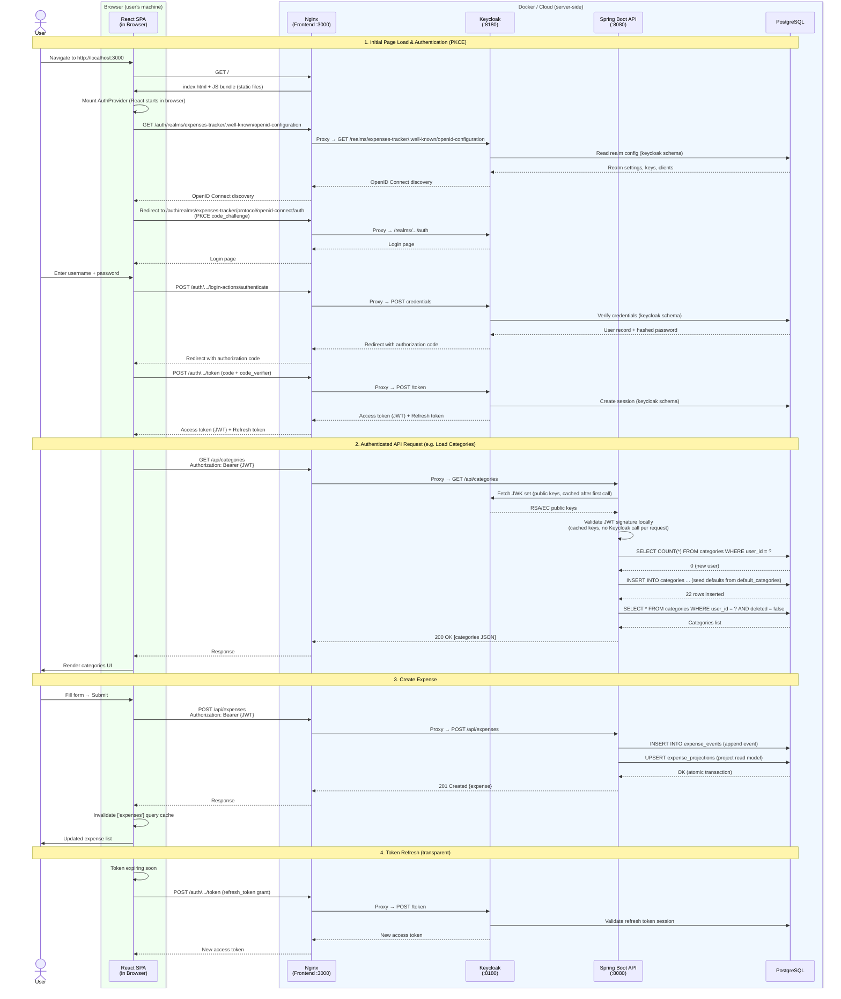

# Expenses Tracker with Event Sourcing & CQRS

A production-ready, fully reactive **multi-user** expense tracking application with **Keycloak authentication**,
**conflict-free, idempotent multi-device synchronization**, built with **Spring Boot 4**, **Kotlin Coroutines**,
**R2DBC**, and **PostgreSQL**. The project includes a **React 19 + TypeScript + MUI v7** web frontend and a native
**Expo + React Native + TypeScript** mobile module that ports the same event-sourcing engine to SQLite and syncs
across devices via the user's own Google Drive or OneDrive (no backend involvement). It implements a complete
**Event Sourcing** and **CQRS** architecture with an optimized sync engine designed for eventual consistency
across multiple devices.

## 🌟 What Makes This Project Special?

- ✨ **Modern Stack**: Spring Boot 4, Kotlin 2.3.10, Java 21 LTS, PostgreSQL 17
- 🔐 **Multi-User Auth**: Keycloak (OAuth2 / OpenID Connect) with per-user data isolation
- 🎨 **React Web Frontend**: React 19, TypeScript, MUI v7, Vite — responsive for mobile & desktop
- 📱 **Native Mobile App**: Expo SDK 55 + React Native 0.83 + React Native Paper v5 (Material 3) — fully offline-first
  with its own SQLite event store
- ☁️ **BYO Cloud Sync**: Mobile app syncs through the user's own Google Drive `appDataFolder` or OneDrive `approot` — no
  central sync server, no backend dependency
- 🏗️ **Event Sourcing & CQRS**: Proper event-driven architecture with separate read/write models — the same algorithm
  runs on the JVM (Kotlin) and in the mobile app (TypeScript), with a byte-identical JSON wire format
- 🔄 **Multi-Device Sync**: Per-user synchronization via shared file (local filesystem on the backend; cloud-drive on
  mobile)
- 🛡️ **Battle-Tested**: Comprehensive test suite with Testcontainers and real PostgreSQL on the backend, plus 56 Vitest
  unit tests on mobile
- 🚀 **Fully Reactive**: Non-blocking I/O with Spring WebFlux and Kotlin Coroutines
- 🎯 **Production Quality**: Transaction atomicity, idempotency, conflict resolution, error handling

## 📑 Table of Contents

- [Expenses Tracker with Event Sourcing \& CQRS](#expenses-tracker-with-event-sourcing--cqrs)
  - [🌟 What Makes This Project Special?](#-what-makes-this-project-special)
  - [📑 Table of Contents](#-table-of-contents)
  - [🎯 Project Overview](#-project-overview)
    - [Real-World Use Case](#real-world-use-case)
  - [✨ Key Features](#-key-features)
    - [Authentication \& Multi-User](#authentication--multi-user)
    - [Event Sourcing \& CQRS Architecture](#event-sourcing--cqrs-architecture)
    - [Efficient Sync Engine](#efficient-sync-engine)
    - [Technology](#technology)
  - [🛠 Technology Stack](#-technology-stack)
    - [Core Framework](#core-framework)
    - [Authentication](#authentication)
    - [Reactive Stack](#reactive-stack)
    - [Database \& Migrations](#database--migrations)
    - [Build \& Testing](#build--testing)
    - [Frontend](#frontend)
    - [Mobile](#mobile)
  - [📁 Project Structure](#-project-structure)
  - [📚 Module Documentation](#-module-documentation)
  - [🔀 Communication Flow](#-communication-flow)
  - [🏗 Sync Engine Architecture](#-sync-engine-architecture)
    - [Design Principles](#design-principles)
    - [Event Sourcing Model](#event-sourcing-model)
    - [CQRS Architecture](#cqrs-architecture)
    - [Database Schema](#database-schema)
      - [**Table: `expense_projections`** (Read Model / Materialized View)](#table-expense_projections-read-model--materialized-view)
      - [**Table: `expense_events`** (Event Store / Source of Truth)](#table-expense_events-event-store--source-of-truth)
      - [**Table: `processed_events`** (Idempotency Registry)](#table-processed_events-idempotency-registry)
      - [**Table: `categories`** (User-Configurable Categories)](#table-categories-user-configurable-categories)
      - [**Table: `default_categories`** (Language-Agnostic Templates)](#table-default_categories-language-agnostic-templates)
    - [Conflict Resolution](#conflict-resolution)
      - [**Projection Update Implementation**](#projection-update-implementation)
    - [Sync Workflow](#sync-workflow)
      - [**Phase 1: Local Write (User Action)**](#phase-1-local-write-user-action)
      - [**Phase 2: Efficient Sync Cycle**](#phase-2-efficient-sync-cycle)
      - [**Phase 3: Event Processing with Idempotency**](#phase-3-event-processing-with-idempotency)
      - [**Phase 4: Collect Local Events**](#phase-4-collect-local-events)
      - [**Phase 5: Upload to Shared File**](#phase-5-upload-to-shared-file)
      - [**Phase 6: Download from Shared File**](#phase-6-download-from-shared-file)
      - [**Phase 7: Process Remote Events**](#phase-7-process-remote-events)
    - [Mobile Sync (TypeScript Port)](#mobile-sync-typescript-port)
      - [Automatic Sync Triggers, Throttling, and Bandwidth](#automatic-sync-triggers-throttling-and-bandwidth)
      - [Apply-Time Optimizations \& Cold-Install Fast Path](#apply-time-optimizations--cold-install-fast-path)
        - [Design Alternatives Considered — Why Not Full LSM Compaction?](#design-alternatives-considered--why-not-full-lsm-compaction)
    - [Component Architecture](#component-architecture)
    - [Sync File Format](#sync-file-format)
    - [Component Diagram](#component-diagram)
    - [Transaction Boundaries](#transaction-boundaries)
    - [Idempotency Guarantees](#idempotency-guarantees)
      - [**Application-Level Idempotency**](#application-level-idempotency)
      - [**Database-Level Idempotency**](#database-level-idempotency)
      - [**Network Retry Idempotency**](#network-retry-idempotency)
  - [🎨 Why This Architecture?](#-why-this-architecture)
    - [Event Sourcing Benefits](#event-sourcing-benefits)
    - [CQRS Benefits](#cqrs-benefits)
    - [Efficient Synchronization](#efficient-synchronization)
    - [Clear Domain Model](#clear-domain-model)
    - [Multi-Device Support](#multi-device-support)
  - [💡 Technical Decisions](#-technical-decisions)
    - [Why Event Sourcing?](#why-event-sourcing)
    - [Why Timestamp-Only Conflict Resolution?](#why-timestamp-only-conflict-resolution)
    - [Why Separate ExpenseSyncProjector and ExpenseSyncRecorder?](#why-separate-expensesyncprojector-and-expensesyncrecorder)
    - [Why PostgreSQL for Tests?](#why-postgresql-for-tests)
  - [⚙ Configuration](#-configuration)
    - [Docker Compose Configuration](#docker-compose-configuration)
  - [🚀 Getting Started](#-getting-started)
    - [Prerequisites](#prerequisites)
    - [Quick Start](#quick-start)
      - [Clone \& Build](#clone--build)
      - [Run the Stack](#run-the-stack)
      - [Production Build (Frontend)](#production-build-frontend)
    - [Docker Compose (Alternative)](#docker-compose-alternative)
      - [Configuration Overview](#configuration-overview)
        - [Using Docker Compose (Recommended)](#using-docker-compose-recommended)
        - [Useful Docker Compose Commands](#useful-docker-compose-commands)
        - [Windows PowerShell Equivalents](#windows-powershell-equivalents)
        - [Troubleshooting Docker Compose](#troubleshooting-docker-compose)
        - [Docker Environment Variables](#docker-environment-variables)
        - [Using .env File for Configuration (Recommended)](#using-env-file-for-configuration-recommended)
  - [🔄 CI/CD](#-cicd)
  - [🤖 Copilot Instructions](#-copilot-instructions)
  - [📚 References](#-references)
    - [Documentation](#documentation)
    - [Key Learnings](#key-learnings)
    - [Tech Stack Versions](#tech-stack-versions)

---

## 🎯 Project Overview

This is a **multi-user, multi-device expense tracker** with **Keycloak authentication** and **file-based
synchronization** using a shared file system (emulating cloud storage like Dropbox, Google Drive, etc.).
Each user's data (expenses, categories, sync files) is fully isolated. The sync engine is designed to be:

- ✅ **Conflict-free** - Automatic conflict resolution using last-write-wins
- ✅ **Idempotent** - Safe to retry operations without duplicates
- ✅ **Eventually consistent** - All devices converge to the same state
- ✅ **User-isolated** - Per-user data, categories, and sync files
- ✅ **Portable** - Simple SQL designed for Android/SQLite migration
- ✅ **Transactional** - Atomic operations prevent partial state

### Real-World Use Case

**Scenario:** Multiple users each track their own expenses across devices

- Users authenticate via Keycloak (self-registration enabled)
- Each user sees only their own expenses and categories
- Each user's devices sync through per-user sync files
- No internet connection required for local operations
- Changes sync automatically when file access available
- Conflicts resolved automatically (newest change wins)

---

## ✨ Key Features

### Authentication & Multi-User

- ✅ **Keycloak Integration** - OAuth2 / OpenID Connect via Keycloak identity provider
- ✅ **Per-User Data Isolation** - All data (expenses, events, categories) scoped by `user_id`
- ✅ **Per-User Sync Files** - Sync files stored in `{basePath}/{userId}/` directories
- ✅ **JWT Validation** - Backend validates Keycloak JWTs as an OAuth2 Resource Server
- ✅ **PKCE Flow** - Secure SPA authentication (no client secret)
- ✅ **Self-Registration** - Users can register directly via Keycloak
- ✅ **Auto Token Refresh** - Frontend transparently refreshes expired tokens

### Event Sourcing & CQRS Architecture

- ✅ **Event Store** - All changes captured as immutable events in `expense_events` table (source of truth)
- ✅ **Projections** - Materialized view in `expense_projections` table for fast queries (read model)
- ✅ **CQRS Pattern** - Separate command service (writes) and query service (reads) for optimal performance
- ✅ **Complete Audit Trail** - Every change is permanently recorded as an event
- ✅ **Domain-Specific Naming** - Clear, business-focused terminology throughout the codebase

### Efficient Sync Engine

- ✅ **Network Optimized** - Single file download per sync cycle (minimal bandwidth usage)
- ✅ **Last-Write-Wins** - Simple, deterministic timestamp-based conflict resolution
- ✅ **Idempotent Operations** - Duplicate events safely ignored via `processed_events` table
- ✅ **Out-of-Order Handling** - Events applied correctly regardless of arrival order
- ✅ **Soft Delete** - Deleted expenses preserved for synchronization
- ✅ **Transactional Execution** - All-or-nothing operations ensure data consistency
- ✅ **Comprehensive Testing** - 50+ tests covering all sync scenarios

### Technology

- ✅ **Fully Reactive Stack** - Spring WebFlux + Kotlin Coroutines + R2DBC
- ✅ **React Frontend** - React 19 + TypeScript + MUI v7, responsive for mobile & desktop
- ✅ **Keycloak Auth** - OAuth2 Resource Server (backend) + keycloak-js PKCE (frontend)
- ✅ **User-Configurable Categories** - Per-user expense categories with icons and colors
- ✅ **REST API** - CRUD operations for expense and category management
- ✅ **Database Migrations** - Flyway with PostgreSQL
- ✅ **Testcontainers** - Real PostgreSQL for integration tests
- ✅ **Docker Support** - Complete containerized deployment (PostgreSQL, Keycloak, API, Frontend)

---

## 🛠 Technology Stack

### Core Framework

- **Spring Boot 4.0.1** - Latest with enhanced reactive support
- **Kotlin 2.3.10** - Modern JVM language with coroutines
- **Java 21** - Long-term support (LTS) release

### Authentication

- **Keycloak 26.2** - Identity and access management (OAuth2 / OpenID Connect)
- **Spring Security OAuth2 Resource Server** - JWT validation on the backend
- **keycloak-js** - Frontend PKCE authentication flow

### Reactive Stack

- **Spring WebFlux** - Non-blocking reactive web framework
- **Kotlin Coroutines** - Structured concurrency with suspend functions
- **R2DBC** - Reactive Relational Database Connectivity
    - Production & Tests: `r2dbc-postgresql` driver

### Database & Migrations

- **PostgreSQL 17** - Production database
- **Flyway** - Database migrations (JDBC-based)
- **R2DBC** - Runtime reactive queries
- **Testcontainers** - Real PostgreSQL for integration tests

### Build & Testing

- **Gradle 9.4.0** with Kotlin DSL
- **JUnit 5** - Test framework
- **Mockito with @MockitoSpyBean** - Mocking framework
- **AssertJ** - Fluent assertions
- **Docker Compose** - Container orchestration

### Frontend

- **React 19** - UI library
- **TypeScript** - Type-safe JavaScript (strict mode)
- **MUI (Material UI) v7** - Component library
- **Vite 8** - Build tool and dev server
- **React Router DOM v7** - Client-side routing
- **TanStack Query** (`@tanstack/react-query`) - Server state management
- **keycloak-js** - Keycloak JavaScript adapter (PKCE flow)
- **@mui/x-charts** - Charting (donut/pie charts for category breakdown)

### Mobile

The mobile app is **fully offline-first** and **does not talk to the backend API**. It has its own SQLite event store
and syncs across devices via the user's own Google Drive (`appDataFolder`) or OneDrive (`approot`).

- **Expo SDK 55** + **React Native 0.83** + **React 19.2**
- **TypeScript** (strict + `verbatimModuleSyntax` + `exactOptionalPropertyTypes`)
- **React Native Paper v5** — Material 3 component library
- **Expo Router** — file-based routing with typed routes
- **expo-sqlite** — local event store + projection + idempotency registry (port of the backend's three tables)
- **TanStack Query** — wraps the local store, mirroring the web frontend's data-fetching layer
- **expo-auth-session** — OAuth 2.0 + PKCE for Google Drive / OneDrive (no client secret)
- **expo-secure-store** — Keychain (iOS) / Keystore (Android) for tokens
- **expo-background-fetch** + **expo-task-manager** — periodic sync when the app is backgrounded
- **pako** — gzip encode/decode of `sync.json.gz` (byte-identical to the backend's `SyncFileManager` output)
- **i18next** + **react-i18next** — locale JSON copied at build time from the web frontend
- **Vitest** — pure-TypeScript unit tests for `src/domain/`, `src/sync/`, and `src/test/` (56 tests)

---

## 📁 Project Structure

```
expenses-tracker-playground/
├── expenses-tracker-api/          # Backend application module
│   ├── src/
│   │   ├── main/
│   │   │   ├── kotlin/com/vshpynta/expenses/api/
│   │   │   │   ├── config/            # Configuration classes
│   │   │   │   │   ├── FlywayConfig.kt        # Flyway JDBC datasource
│   │   │   │   │   ├── JacksonConfig.kt       # Jackson 2.x ObjectMapper bean
│   │   │   │   │   ├── R2dbcConfig.kt         # UUID converter wiring
│   │   │   │   │   ├── SecurityConfig.kt      # OAuth2 Resource Server + CORS
│   │   │   │   │   └── TransactionConfig.kt   # Reactive transaction manager
│   │   │   │   ├── controller/        # REST API endpoints
│   │   │   │   │   ├── dto/          # Data Transfer Objects
│   │   │   │   │   ├── ExpensesController.kt
│   │   │   │   │   ├── CategoriesController.kt
│   │   │   │   │   └── GlobalExceptionHandler.kt
│   │   │   │   ├── model/            # Domain models
│   │   │   │   │   ├── ExpenseEvent.kt         # Event store model
│   │   │   │   │   ├── ExpenseProjection.kt    # Read model
│   │   │   │   │   ├── Category.kt             # User category model
│   │   │   │   │   ├── CategoryExpenseCount.kt # Aggregate query result
│   │   │   │   │   ├── DefaultCategory.kt      # Template seed model
│   │   │   │   │   ├── EventType.kt            # Event types enum
│   │   │   │   │   ├── EventSyncFile.kt        # Sync file format + EventEntry
│   │   │   │   │   ├── ExpensePayload.kt       # JSON payload model
│   │   │   │   │   └── ProcessedEvent.kt       # Idempotency tracking
│   │   │   │   ├── repository/       # Data access layer
│   │   │   │   │   ├── ExpenseEventRepository.kt      # Event store
│   │   │   │   │   ├── ExpenseProjectionRepository.kt # Read model
│   │   │   │   │   ├── CategoryRepository.kt          # Categories
│   │   │   │   │   ├── DefaultCategoryRepository.kt   # Default category templates
│   │   │   │   │   └── ProcessedEventRepository.kt    # Idempotency
│   │   │   │   ├── service/          # Business logic
│   │   │   │   │   ├── ExpenseCommandService.kt       # CQRS write side
│   │   │   │   │   ├── ExpenseQueryService.kt         # CQRS read side
│   │   │   │   │   ├── ExpenseEventSyncService.kt     # Sync orchestration
│   │   │   │   │   ├── ExpenseMapper.kt               # Entity ↔ DTO mapping
│   │   │   │   │   ├── ExpenseSyncProjector.kt        # Idempotency + cache layer
│   │   │   │   │   ├── ExpenseSyncRecorder.kt         # Transactional recorder
│   │   │   │   │   ├── CategoryService.kt             # Category CRUD
│   │   │   │   │   ├── CategoryMapper.kt              # Category entity ↔ DTO mapping
│   │   │   │   │   ├── DefaultCategorySeeder.kt       # Lazy default-category seeding
│   │   │   │   │   ├── ProcessedEventsCache.kt        # In-memory cache
│   │   │   │   │   ├── auth/                          # Authentication
│   │   │   │   │   │   └── UserContextService.kt      # Extract userId from JWT
│   │   │   │   │   └── sync/                          # Sync subsystem
│   │   │   │   │       ├── FileOperations.kt          # File I/O utilities
│   │   │   │   │       ├── RemoteEventProcessor.kt    # Remote event processing
│   │   │   │   │       └── SyncFileManager.kt         # Per-user sync file read/write
│   │   │   │   ├── util/             # Utilities
│   │   │   │   └── ExpensesTrackerApiApplication.kt
│   │   │   └── resources/
│   │   │       ├── application.yaml  # Application configuration
│   │   │       └── db/migration/     # Flyway migrations
│   │   │           ├── V1__Initial_schema.sql           # Versioned: schema only
│   │   │           └── R__Seed_default_categories.sql   # Repeatable: default templates
│   │   └── test/                     # Comprehensive test suite
│   │       ├── kotlin/com/vshpynta/expenses/api/
│   │       │   ├── config/           # Test security & Testcontainers config
│   │       │   ├── controller/       # API integration tests
│   │       │   ├── repository/       # Repository tests
│   │       │   └── service/          # Service tests
│   │       └── resources/
│   │           └── application-test.yaml
│   ├── build.gradle.kts
│   └── Dockerfile
├── expenses-tracker-frontend/     # Frontend React application
│   ├── src/
│   │   ├── main.tsx               # Entry point (AuthProvider, QueryClient, Router)
│   │   ├── App.tsx                # Layout shell + Routes + ThemeProvider
│   │   ├── theme.ts               # MUI dark/light theme with toggle
│   │   ├── api/                   # Typed fetch wrappers for REST API
│   │   │   ├── expenses.ts        # Expense API calls (authenticated)
│   │   │   ├── categories.ts      # Category API calls (authenticated)
│   │   │   ├── exchange.ts        # Currency exchange-rate API calls
│   │   │   ├── fetchWithAuth.ts   # Fetch wrapper with JWT Bearer token
│   │   │   └── handleResponse.ts  # Shared response/error handling
│   │   ├── config/                # App configuration
│   │   │   └── keycloak.ts        # Keycloak instance configuration
│   │   ├── context/               # React context providers
│   │   │   └── AuthContext.tsx    # Auth provider (login, token, userId)
│   │   ├── i18n/                  # i18next config + translation namespaces
│   │   ├── components/            # Shared reusable components
│   │   │   ├── Layout.tsx                  # Responsive shell (sidebar + bottom nav + logout)
│   │   │   ├── AddExpenseDialog.tsx        # Create/edit expense dialog
│   │   │   ├── add-expense/                # Add-expense subcomponents
│   │   │   ├── amount-keypad/              # Calculator-style amount keypad
│   │   │   ├── CategoryDonutChart.tsx      # Donut chart (MUI X Charts)
│   │   │   ├── CategoryFormDialog.tsx      # Category create/rename form
│   │   │   ├── CategoryPickerDialog.tsx    # Category selection
│   │   │   ├── CurrencyPickerDialog.tsx    # Currency selection
│   │   │   ├── DateRangeSelector.tsx       # Date range navigator
│   │   │   ├── date-range/                 # Date-range subcomponents
│   │   │   ├── FontSizePickerDialog.tsx    # User font-size preference
│   │   │   ├── LanguagePickerDialog.tsx    # i18n language switcher
│   │   │   ├── ManageCategoriesDialog.tsx  # Manage user categories
│   │   │   ├── manage-categories/          # Manage-categories subcomponents
│   │   │   ├── SpendingDateHeader.tsx      # Header with date + total
│   │   │   ├── transactions/               # Transaction list components
│   │   │   ├── transitions/                # Shared transition primitives
│   │   │   └── layout/                     # Layout subcomponents
│   │   ├── hooks/                 # Custom React hooks
│   │   │   ├── useExpenses.ts          # Fetch expenses (TanStack Query)
│   │   │   ├── useExpenseMutations.ts  # Create/update/delete/sync mutations
│   │   │   ├── useCategories.ts        # Category query hook
│   │   │   ├── useCategoryLookup.ts    # id → (name, icon, color) resolver
│   │   │   ├── useCategorySummary.ts   # Derive category totals
│   │   │   ├── useCurrency.ts          # Per-user currency preference
│   │   │   ├── useDateRange.ts         # Per-user date range preference
│   │   │   └── useExchangeRates.ts     # Currency exchange-rate query
│   │   ├── pages/                 # Page-level components (one per route)
│   │   │   ├── CategoriesPage.tsx      # Categories + donut chart
│   │   │   ├── TransactionsPage.tsx    # Transaction list
│   │   │   └── OverviewPage.tsx        # Overview
│   │   ├── test/                  # Test utilities and setup
│   │   ├── types/                 # TypeScript interfaces
│   │   └── utils/                 # Pure utility functions
│   ├── build.gradle.kts           # Gradle build (npm install + build via node plugin)
│   ├── Dockerfile                 # Multi-stage build (Node → nginx)
│   ├── nginx.conf                 # nginx config (static files + /api + /auth proxy)
│   ├── package.json
│   ├── vite.config.ts             # Vite + /api proxy to backend
│   ├── tsconfig.json
│   └── index.html
├── expenses-tracker-mobile/      # Native mobile app (Expo + React Native)
│   ├── app/                       # Expo Router file-based screens
│   │   ├── _layout.tsx            # PaperProvider + i18n + DB + QueryClient
│   │   └── index.tsx              # Home screen (placeholder)
│   ├── src/
│   │   ├── domain/                # Pure TypeScript event-sourcing core
│   │   │   ├── types.ts           # Mirrors backend Kotlin model 1:1
│   │   │   ├── mapping.ts         # Event payload ↔ projection
│   │   │   ├── localStore.ts      # LocalStore interface (DIP boundary)
│   │   │   ├── projector.ts       # Last-write-wins projection (port of backend)
│   │   │   ├── commands.ts        # createExpense / updateExpense / deleteExpense
│   │   │   └── queries.ts         # findAllExpenses / findExpenseById
│   │   ├── db/                    # expo-sqlite implementation of LocalStore
│   │   │   ├── schema.ts
│   │   │   ├── migrations.ts      # PRAGMA user_version migrations
│   │   │   ├── sqliteLocalStore.ts
│   │   │   └── databaseProvider.tsx
│   │   ├── sync/                  # Pure-TS sync engine + cloud-drive adapters
│   │   │   ├── cloudDriveAdapter.ts   # Provider-agnostic interface (DIP)
│   │   │   ├── codec.ts               # gzip + JSON encode/decode
│   │   │   ├── remoteEventApplier.ts  # Idempotency + projection
│   │   │   ├── syncEngine.ts          # Orchestration (download → apply → upload)
│   │   │   ├── oauthClient.ts         # Shared PKCE + secure-store + refresh
│   │   │   ├── googleDriveAdapter.ts  # Drive `appDataFolder` adapter
│   │   │   ├── oneDriveAdapter.ts     # OneDrive `approot` adapter
│   │   │   └── backgroundSync.ts      # expo-background-fetch task wiring
│   │   ├── i18n/                  # i18next bootstrap + locale JSON
│   │   ├── theme/                 # MD3 light/dark theme
│   │   ├── test/                  # In-memory fakes + fixtures (Vitest)
│   │   ├── utils/                 # TimeProvider, logger
│   │   ├── queryClient.ts         # TanStack Query client + query keys
│   │   └── types/                 # Shared TS interfaces
│   ├── scripts/
│   │   └── copy-locales.mjs       # Mirrors locale JSON from web frontend
│   ├── app.json                   # Expo config (scheme = expensestracker)
│   ├── build.gradle.kts           # Gradle shim driving npm via the node plugin
│   ├── package.json
│   └── tsconfig.json
├── keycloak/
│   └── realm-export.json          # Pre-configured Keycloak realm for auto-import
├── gradle/
│   ├── libs.versions.toml           # Centralized dependency versions
│   └── wrapper/
├── build.gradle.kts                  # Root build configuration
├── settings.gradle.kts               # Multi-module configuration (api + frontend + mobile)
├── docker-compose.yml                # Container orchestration (postgres, keycloak, api, frontend)
├── expenses-tracker-api.http         # HTTP request examples
└── README.md

Key Components:
- SecurityConfig: OAuth2 Resource Server security configuration
- UserContextService: Extracts userId from JWT security context
- ExpenseEvent: Immutable event representing a change (scoped by userId)
- ExpenseProjection: Current state optimized for queries (scoped by userId)
- Category: User-configurable expense category (scoped by userId)
- EventType: CREATED, UPDATED, DELETED
- ExpenseCommandService: Handles write operations (CQRS)
- ExpenseQueryService: Handles read operations (CQRS)
- CategoryService: Category CRUD operations
- ExpenseEventSyncService: Orchestrates per-user synchronization
- ExpenseSyncProjector: Projects events with idempotency checks
- ExpenseSyncRecorder: Transactional database recorder
- ProcessedEventsCache: In-memory cache for performance
- SyncFileManager: Per-user sync file management
- AuthContext / keycloak.ts: Frontend Keycloak authentication
- fetchWithAuth: Authenticated fetch wrapper with auto token refresh
```

---

## 📚 Module Documentation

Each module has its own README with running instructions, configuration, REST endpoints, build steps,
and module-specific troubleshooting:

| Module                                    | README                                                                         | Covers                                                                                                                                                                                                                                                            |
|-------------------------------------------|--------------------------------------------------------------------------------|-------------------------------------------------------------------------------------------------------------------------------------------------------------------------------------------------------------------------------------------------------------------|
| `expenses-tracker-api/` (backend)         | [`expenses-tracker-api/README.md`](./expenses-tracker-api/README.md)           | Running the backend, environment variables & `application.yaml`, Flyway migrations, REST API endpoints + curl examples, `http-client.env.json` environments, Testcontainers test suite, performance optimization (batch processing), backend troubleshooting.    |
| `expenses-tracker-frontend/` (web)        | [`expenses-tracker-frontend/README.md`](./expenses-tracker-frontend/README.md) | Frontend features, `src/` architecture, Vite dev server, npm commands, API/auth proxy, Keycloak / PKCE wiring.                                                                                                                                                    |
| `expenses-tracker-mobile/` (Expo / RN)    | [`expenses-tracker-mobile/README.md`](./expenses-tracker-mobile/README.md)     | Running the mobile app, simulator / emulator setup, dev client with `npx expo run:android`, building & sideloading a production APK, Cloud-Drive OAuth client IDs (Google Drive / OneDrive).                                                                      |

Path-scoped Copilot rules for each module live in [`.github/instructions/`](./.github/instructions/).

---
## 🔀 Communication Flow

The user enters **`http://localhost:3000`** — this is the Nginx frontend URL which acts as the single entry
point. Nginx serves the React SPA and reverse-proxies `/api/*` to the backend and `/auth/*` to Keycloak.
There is no separate API gateway; Nginx fulfills that role in this architecture.

The following diagram shows the complete request lifecycle — from initial page load and Keycloak PKCE
authentication, through authenticated API calls with JWT, to token refresh:



**Key points:**

- **Client vs Server** — The React SPA is served as static files by Nginx but runs entirely **in the user's browser**.
  After the initial download, all UI rendering and state management happens client-side. The green box is the user's
  machine; the blue box is server-side infrastructure (Docker containers or cloud).
- **Shared PostgreSQL** — Both Keycloak and the application use the same PostgreSQL instance but different schemas:
  Keycloak uses the `keycloak` schema (realm config, users, sessions, credentials), while the application uses the
  `public` schema (expenses, events, categories).
- **Local dev** — Vite proxies `/api/*` to `localhost:8080` and `/auth/*` to `localhost:8180` (Keycloak). The browser
  always uses `localhost:3000` as the origin.
- **Docker Compose** — Nginx on port 3000 is the single entry point. It proxies `/api/*` → `expenses-api:8080` and
  `/auth/*` → `keycloak:8180`. All browser traffic (API calls **and** authentication) goes through Nginx.
- **JWT validation** — The API fetches Keycloak's JWK set (public keys) once on startup via `jwk-set-uri` (
  container-to-container: `keycloak:8180/auth`) and caches them. Token validation is then done **locally** using
  cryptographic verification — no Keycloak call per request. The `issuer-uri` matches what `KC_HOSTNAME` pins as the
  public URL (`localhost:3000/auth` in Docker, configurable in `application.yaml` for dev).
- **Lazy seeding** — On first API call for a new user, default categories are copied from the `default_categories`
  template table.

---

## 🏗 Sync Engine Architecture

### Design Principles

The sync engine is built on these core principles:

1. **Event Sourcing** - All changes are immutable events in an append-only log
2. **CQRS** - Command Query Responsibility Segregation (separate read/write models)
3. **Idempotency** - Events can be processed multiple times safely without side effects
4. **Eventual Consistency** - All devices converge to the same state over time
5. **Decentralized** - No central server required - peer-to-peer sync via shared file
6. **Portable SQL** - Simple queries designed for easy Android/SQLite migration
7. **Transaction Atomicity** - All operations succeed together or fail together
8. **Network Efficiency** - Minimized data transfer with smart sync algorithm

### Event Sourcing Model

Every expense modification (create, update, delete) generates an **event**:

```kotlin
data class ExpenseEvent(
    val eventId: UUID,           // Unique event identifier
    val timestamp: Long,         // When the event occurred (milliseconds since epoch)
    val eventType: EventType,    // CREATED, UPDATED, DELETED
    val expenseId: UUID,         // The expense this event is about
    val payload: String,         // Complete expense state (JSON)
    val committed: Boolean = false,  // Has been synced to file?
    val userId: String           // Owner of this event
) : Persistable<UUID>
```

**Key insights:**

- Events are **immutable** - once created, they never change
- `eventId` identifies the event itself (unique per event)
- `expenseId` identifies which expense the event modifies (same across all events for one expense)
- Events form an **append-only log** - the source of truth

### CQRS Architecture

```
┌─────────────────────────────────────────────────────────────┐
│                    CQRS Pattern                             │
└─────────────────────────────────────────────────────────────┘

Write Side (Commands):
  User Action → ExpenseCommandService
                    ↓
             Creates ExpenseEvent
                    ↓
          Saves to expense_events table
                    ↓
          Projects to expense_projections table
                    ↓
              Updates Read Model

Read Side (Queries):
  User Query → ExpenseQueryService
                    ↓
       Reads from expense_projections table
                    ↓
           Returns current state
```

### Database Schema

The sync engine uses **three tables** working together, plus a **categories** table.
All data tables include a `user_id` column for per-user data isolation.

#### **Table: `expense_projections`** (Read Model / Materialized View)

Current state of all expenses (optimized for queries):

```sql
CREATE TABLE expense_projections
(
    id          VARCHAR(36) PRIMARY KEY,
    description VARCHAR(500),
    amount      BIGINT       NOT NULL,
    currency    VARCHAR(3)   NOT NULL DEFAULT 'USD',
    category_id VARCHAR(36),
    date        VARCHAR(50),
    updated_at  BIGINT       NOT NULL,
    deleted     BOOLEAN      NOT NULL DEFAULT FALSE,
    user_id     VARCHAR(255) NOT NULL
);

CREATE INDEX idx_expense_projections_updated_at  ON expense_projections (updated_at);
CREATE INDEX idx_expense_projections_deleted     ON expense_projections (deleted);
CREATE INDEX idx_expense_projections_category_id ON expense_projections (category_id);
CREATE INDEX idx_expense_projections_user_id     ON expense_projections (user_id);
```

> **Note:** `category_id` references `categories.id` but is intentionally **not** a foreign key —
> cross-device sync may deliver an expense event before the corresponding category row has been
> seeded locally. The frontend resolves `id → (name, icon, color)` at render time.

#### **Table: `expense_events`** (Event Store / Source of Truth)

Immutable append-only log of all modifications:

```sql
CREATE TABLE expense_events
(
    event_id   VARCHAR(36) PRIMARY KEY,
    timestamp  BIGINT       NOT NULL,
    event_type VARCHAR(20)  NOT NULL CHECK (event_type IN ('CREATED', 'UPDATED', 'DELETED')),
    expense_id VARCHAR(36)  NOT NULL,
    payload    TEXT         NOT NULL, -- JSON
    committed  BOOLEAN      NOT NULL DEFAULT FALSE,
    user_id    VARCHAR(255) NOT NULL
);

CREATE INDEX idx_expense_events_committed ON expense_events (committed);
CREATE INDEX idx_expense_events_timestamp ON expense_events (timestamp);
CREATE INDEX idx_expense_events_expense_id ON expense_events (expense_id);
CREATE INDEX idx_expense_events_user_id ON expense_events (user_id);
```

#### **Table: `processed_events`** (Idempotency Registry)

Tracks which events have been processed to prevent duplicates:

```sql
CREATE TABLE processed_events
(
    event_id VARCHAR(36) PRIMARY KEY
);
```

#### **Table: `categories`** (User-Configurable Categories)

Per-user expense categories with customizable icons and colors. Rows seeded from
`default_categories` carry a non-NULL `template_key`; user-created categories have
`template_key = NULL` and a non-NULL `name`. Category names are translated on the
frontend via i18n when `template_key` is set and `name` is NULL.

```sql
CREATE TABLE categories
(
    id           VARCHAR(36) PRIMARY KEY,
    name         VARCHAR(100), -- NULL → frontend renders translated template name
    template_key VARCHAR(50),  -- links to default_categories.template_key
    icon         VARCHAR(50)  NOT NULL,
    color        VARCHAR(7)   NOT NULL,
    sort_order   INT          NOT NULL DEFAULT 0,
    updated_at   BIGINT       NOT NULL,
    deleted      BOOLEAN      NOT NULL DEFAULT FALSE,
    user_id      VARCHAR(255) NOT NULL,
    CONSTRAINT chk_categories_name_or_template
        CHECK (name IS NOT NULL OR template_key IS NOT NULL)
);

-- Active custom names are unique per user (case-sensitive).
CREATE UNIQUE INDEX idx_categories_name_user
    ON categories (user_id, name)
    WHERE deleted = false AND name IS NOT NULL;

-- One row per (user, template) — used as ON CONFLICT target for "reset to defaults".
CREATE UNIQUE INDEX idx_categories_user_template
    ON categories (user_id, template_key)
    WHERE template_key IS NOT NULL;
```

#### **Table: `default_categories`** (Language-Agnostic Templates)

Read-only template table seeded for new users. `template_key` is a stable,
language-independent slug; the frontend translates each slug at display time
via the `categoryTemplates.*` i18n namespace, so no `name` column is stored.

```sql
CREATE TABLE default_categories
(
    template_key VARCHAR(50) PRIMARY KEY,
    icon         VARCHAR(50) NOT NULL,
    color        VARCHAR(7)  NOT NULL,
    sort_order   INT         NOT NULL DEFAULT 0
);
```

Seeded by the repeatable migration `R__Seed_default_categories.sql` so templates
can evolve (new entries, color/icon tweaks) without piling up `V_` history.

**Why the tables are designed this way:**

- `expense_projections` - Fast queries for current state (read model), filtered by `user_id`
- `expense_events` - Complete audit trail + sync source (event store), scoped by `user_id`
- `processed_events` - Prevents duplicate event processing (idempotency)
- `categories` - User-configurable expense categories, unique active name per user
- `default_categories` - Language-agnostic template table; new users are seeded from it on first access

### Conflict Resolution

**Strategy: Last-Write-Wins (LWW)**

The event with the **highest timestamp** wins. Simple, deterministic, and consistent across all devices.

#### **Projection Update Implementation**

```sql
-- projectFromEvent() - Idempotent upsert with conflict resolution
INSERT INTO expense_projections (id, description, amount, currency, category_id, date, updated_at, deleted, user_id)
VALUES (?, ?, ?, ?, ?, ?, ?, ?, ?) ON CONFLICT (id) DO
UPDATE SET
    description = EXCLUDED.description,
    amount      = EXCLUDED.amount,
    currency    = EXCLUDED.currency,
    category_id = EXCLUDED.category_id,
    date        = EXCLUDED.date,
    updated_at  = EXCLUDED.updated_at,
    deleted     = EXCLUDED.deleted
WHERE EXCLUDED.updated_at > expense_projections.updated_at;
```

**How it works:**

- ✅ Update **only if** new timestamp > old timestamp
- ✅ Older events are **rejected** (returns 0 rows affected)
- ✅ Same event twice is **idempotent** (no effect on second try)
- ✅ Works for CREATED, UPDATED, and DELETED (soft delete sets `deleted=true`)
- ✅ No special delete priority - **All events follow same timestamp rule**

**Example scenarios:**

| Existing State                   | Event                                        | Result                       |
|----------------------------------|----------------------------------------------|------------------------------|
| `updated_at=1000`                | UPDATED with `timestamp=2000`                | ✅ Updated (newer wins)       |
| `updated_at=2000`                | UPDATED with `timestamp=1000`                | ❌ Rejected (older loses)     |
| `updated_at=1000`                | UPDATED with `timestamp=1000`                | ❌ Rejected (equal timestamp) |
| `updated_at=2000, deleted=false` | DELETED with `timestamp=3000`                | ✅ Deleted (newer wins)       |
| `updated_at=2000, deleted=false` | DELETED with `timestamp=1000`                | ❌ Rejected (older loses)     |
| `updated_at=2000, deleted=true`  | UPDATED with `timestamp=3000, deleted=false` | ✅ Resurrected (newer wins)   |

### Sync Workflow

#### **Phase 1: Local Write (User Action)**

When a user creates/updates/deletes an expense (Command Side):

```kotlin
@Transactional
suspend fun createExpense(
    description: String,
    amount: Long,
    currency: String,
    categoryId: UUID,
    date: String
): ExpenseProjection {
    val userId = userContextService.currentUserId()
    val expenseId = UUID.randomUUID()
    val now = timeProvider.currentTimeMillis()

    val payload = ExpensePayload(
        id = expenseId,
        description = description,
        amount = amount,
        currency = currency,
        categoryId = categoryId,
        date = date,
        updatedAt = now,
        deleted = false,
        userId = userId
    )

    // BEGIN TRANSACTION
    // 1. Append event to event store
    appendEvent(EventType.CREATED, expenseId, payload)

    // 2. Project event to read model (UPSERT with last-write-wins)
    projectionRepository.projectFromEvent(payload.toProjection())
    // COMMIT TRANSACTION

    // 3. Return the created projection
    return projectionRepository.findByIdOrNull(expenseId)
        ?: error("Failed to retrieve created expense projection")
}
```

**Atomic guarantee:** Both event store and projection updated together or not at all.

#### **Phase 2: Efficient Sync Cycle**

The sync algorithm is designed for minimal network usage while maintaining consistency:

```kotlin
suspend fun performFullSync() {
    logger.info("Starting sync cycle")

    runCatching {
        syncFileManager.getSyncFile().let { file ->
            // 1. Process remote events if file changed
            file.takeIf { syncFileManager.hasFileChanged(it) }
                ?.let { syncFileManager.readEvents(it) }
                ?.also { remoteEventProcessor.processRemoteEvents(it) }
                ?: logger.info("Sync file unchanged, skipping remote processing")

            // 2. Upload local uncommitted events if any
            collectLocalEvents()
                .takeIf { it.isNotEmpty() }
                ?.also { events ->
                    logger.info("Uploading ${events.size} local uncommitted events")
                    syncFileManager.appendEvents(file, events)
                }

            // 3. Cache checksum for next sync optimization
            syncFileManager.cacheFileChecksum(file)
        }

        logger.info("Sync completed successfully")
    }
}
```

**How it works:**

1. **File Change Detection** - Check if sync file changed using hash comparison (skip processing if unchanged)
2. **Process Remote** - Apply remote events from all devices to update local read model
3. **Collect Local** - Gather events created on this device that haven't been synced yet
4. **Upload** - Append new local events to the shared sync file
5. **Cache Hash** - Store file checksum for next sync optimization

**Why this order:**

- Minimizes network traffic - only processes file if it changed
- File hash caching avoids redundant processing (huge performance gain)
- Local events don't need immediate commit - they'll be processed by all devices in the next sync
- Maintains eventual consistency across all devices
- Idempotency ensures correctness even if sync is interrupted

**Deferred Commit Pattern:**
Local events are marked as `committed=true` during the **next** sync cycle when this device reads them back from the
shared file. This is safe because:

- Events are already persisted in local database (won't be lost)
- Events are written to sync file (other devices can see them immediately)
- The slight delay doesn't affect consistency
- Reduces network operations significantly

#### **Phase 3: Event Processing with Idempotency**

Events are processed through a two-component architecture for transactional correctness:

**Step 1: ExpenseSyncProjector - Idempotency Check & Cache Management**

```kotlin
@Component
class ExpenseSyncProjector {
    suspend fun projectEvent(eventEntry: EventEntry): Boolean {
        val eventId = UUID.fromString(eventEntry.eventId)

        // Fast in-memory cache check (100% accurate)
        if (processedEventsCache.contains(eventId)) {
            return false  // Already processed
        }

        // Double-check DB (safety net for cache misses)
        if (processedEventRepository.hasBeenProcessed(eventId)) {
            processedEventsCache.add(eventId)
            return false
        }

        // Delegate to transactional component
        val success = expenseSyncRecorder.projectAndCommitEvent(eventEntry, eventId)

        // Update cache AFTER successful transaction commit
        if (success) {
            processedEventsCache.add(eventId)
        }

        return success
    }
}
```

**Step 2: ExpenseSyncRecorder - Transactional Persistence**

```kotlin
@Component
class ExpenseSyncRecorder {
    @Transactional
    suspend fun projectAndCommitEvent(
        eventEntry: EventEntry,
        eventId: UUID
    ): Boolean {
        // BEGIN TRANSACTION
        // 1. Project to materialized view (last-write-wins)
        when (EventType.valueOf(eventEntry.eventType)) {
            EventType.CREATED, EventType.UPDATED ->
                projectionRepository.projectFromEvent(eventEntry.toProjection())
            EventType.DELETED ->
                projectionRepository.markAsDeleted(
                    id = UUID.fromString(eventEntry.expenseId),
                    updatedAt = eventEntry.payload.updatedAt
                )
        }

        // 2. Mark as processed (prevents re-processing)
        processedEventRepository.markAsProcessed(eventId)

        // 3. Mark as committed (only affects local events)
        eventRepository.markEventsAsCommitted(listOf(eventId))
        // COMMIT TRANSACTION

        return true
    }
}
```

**Why two components?**

- **ExpenseSyncProjector**: Fast cache-based checks, delegates to transactional component
- **ExpenseSyncRecorder**: Ensures @Transactional proxy works correctly (Spring requirement)
- Cache updated **after** transaction commit (prevents corruption on rollback)

**Transaction guarantees:**

- All 3 steps succeed or all fail together
- No partial application
- Safe to retry
- Idempotent (can process same event multiple times safely)

#### **Phase 4: Collect Local Events**

Query uncommitted events from local event store:

```kotlin
private suspend fun collectLocalEvents() = withContext(Dispatchers.IO) {
    eventRepository.findUncommittedEvents().toList()
}
```

**SQL Query:**

```sql
SELECT *
FROM expense_events
WHERE committed = false
ORDER BY timestamp
```

#### **Phase 5: Upload to Shared File**

Append events to shared JSON file with compression:

```kotlin
suspend fun appendEvents(file: File, events: List<ExpenseEvent>) {
    // Read existing events
    val existingEvents = readEvents(file)

    // Convert and merge events
    val newEventEntries = events.map { it.toEventEntry() }
    val allEvents = existingEvents + newEventEntries

    // Write with gzip compression (70% smaller)
    val json = objectMapper.writeValueAsString(EventSyncFile(allEvents))
    file.outputStream().use { output ->
        GZIPOutputStream(output).use { gzip ->
            gzip.write(json.toByteArray())
        }
    }

    logger.info("Appended ${events.size} events to sync file")
}
```

**Compression Benefits:**

- 70% smaller file size
- Faster uploads/downloads
- Reduced cloud storage costs

#### **Phase 6: Download from Shared File**

Read all events and sort deterministically:

```kotlin
suspend fun readEvents(file: File): List<EventEntry> = withContext(Dispatchers.IO) {
    if (!file.exists()) return@withContext emptyList()

    runCatching {
        // Decompress gzip and parse JSON
        file.inputStream().use { input ->
            GZIPInputStream(input).use { gzip ->
                val json = gzip.readBytes().toString(Charsets.UTF_8)
                objectMapper.readValue(json, EventSyncFile::class.java).events
                    .sortedWith(
                        compareBy<EventEntry> { it.timestamp }
                            .thenBy { it.eventId }
                    )
            }
        }
    }.getOrElse { e ->
        logger.error("Failed to read events from sync file", e)
        emptyList()
    }
}
```

**Sort order is critical:**

- Primary: `timestamp` - earlier events first (chronological order)
- Secondary: `eventId` - deterministic ordering for same timestamp (UUID is unique and comparable)

**Why this sorting?**

- Ensures deterministic ordering across all devices
- Events applied in same order everywhere
- Guarantees eventual consistency
- Provides stable sort for events with identical timestamps

#### **Phase 7: Process Remote Events**

For each event, apply it atomically through the projection system:

```kotlin
suspend fun processRemoteEvents(remoteEvents: List<EventEntry>) {
    val processedCount = remoteEvents.count { event ->
        runCatching<Boolean> {
            expenseSyncProjector.projectEvent(event)
        }.onFailure { e ->
            logger.error("Failed to project event: ${event.eventId}", e)
        }.getOrDefault(false)
    }

    logger.info("Processed $processedCount out of ${remoteEvents.size} remote events")
}
```

**Processing guarantees:**

- Events processed sequentially for consistency
- Individual event failures don't stop entire process
- Each event projected via transactional ExpenseSyncRecorder
- Automatic retry on next sync for failed events
- Idempotency ensures safe reprocessing

### Mobile Sync (TypeScript Port)

The mobile module ships a **second implementation of the same algorithm** — written in TypeScript over
`expo-sqlite` instead of Kotlin over R2DBC — and uses cloud drives instead of the local filesystem. The
JSON wire format (`sync.json.gz`) is **byte-identical** to what the backend's `SyncFileManager` produces,
so a self-hosted backend instance and a mobile device that share the same Drive folder converge transparently.

**Module-level mapping (mobile ↔ backend):**

| Mobile (TypeScript)                     | Backend (Kotlin)                                | Responsibility                                  |
|-----------------------------------------|-------------------------------------------------|-------------------------------------------------|
| `src/domain/projector.ts`               | `ExpenseProjectionRepository`                   | Last-write-wins UPSERT into the projection      |
| `src/domain/commands.ts` / `queries.ts` | `ExpenseCommandService` / `ExpenseQueryService` | CQRS write/read split (single SQLite tx)        |
| `src/sync/syncEngine.ts`                | `ExpenseEventSyncService`                       | Sync orchestration                              |
| `src/sync/codec.ts`                     | `SyncFileManager` (gzip/JSON)                   | Encode/decode the `sync.json.gz` wire format    |
| `src/sync/remoteEventApplier.ts`        | `ExpenseSyncProjector`                          | Idempotency check before applying remote events |
| `src/db/sqliteLocalStore.ts`            | `ExpenseSyncRecorder`                           | Transactional persistence (single tx)           |
| `src/sync/cloudDriveAdapter.ts`         | `FileOperations`                                | I/O abstraction (DIP boundary)                  |
| `src/sync/googleDriveAdapter.ts`        | _(none — file-based locally)_                   | Google Drive `appDataFolder` adapter            |
| `src/sync/oneDriveAdapter.ts`           | _(none — file-based locally)_                   | OneDrive `approot` adapter                      |

**Why `RemoteEventApplier` is still a separate module on mobile**

There is no Spring `@Transactional` proxy on mobile and therefore no self-invocation pitfall to worry about.
The split is preserved anyway because it (a) keeps the projector unit-testable in isolation with an in-memory
`LocalStore` fake, (b) keeps the wire-format contract tests symmetric with the backend, and (c) makes
porting algorithmic changes between the two implementations a 1:1 mechanical translation.

**Cloud-drive flow (single device cycle):**

```
SyncEngine.performFullSync()
  1. adapter.download({ ifNoneMatch: cachedEtag })
        kind = 'not-modified' → cache hit, skip remote-event processing
        kind = 'absent'       → first sync, no remote file yet
        kind = 'modified'     → SyncFileCodec.decode → events[]
             for each event:
                RemoteEventApplier.apply (processed_events idempotency + projection)
  2. LocalStore.findUncommittedEvents
        → SyncFileCodec.encode  → adapter.upload(if-match: etag)
  3. cache new etag for next cycle (and persist it across cold starts — see below)
  4. on 412 Precondition Failed → retry (max 3) — concurrent writer detected
```

> **Note:** the engine never calls a separate `getMetadata()` probe before `download()`. The adapter folds
> the eTag check into the same request (Google Drive: HTTP `If-None-Match`; OneDrive: a single metadata
> round-trip whose response includes the eTag, so a cache hit never touches `/content`). This keeps the
> idle-sync round-trip count to one.

**Concurrency:** the mobile sync engine uses **optimistic eTag** concurrency. Both Drive REST and Microsoft
Graph return an eTag on the file resource; the engine forwards it as `If-Match` on upload. A `412 Precondition
Failed` is thrown as `ConcurrencyError`, the engine reloads the file, re-applies remote events on top, and
retries up to `MAX_RETRIES=3` times. This is stricter than the backend's local-file path (which never has
concurrent writers on the same machine).

**Conflict resolution:** identical to the backend — last-write-wins by timestamp, strict `>`, soft deletes
can be superseded by a newer non-deleted update (resurrection).

**Sort order:** identical — `(timestamp ASC, eventId ASC)` so all devices replay events in the same
deterministic order.

#### Automatic Sync Triggers, Throttling, and Bandwidth

The mobile module fires sync automatically — components and hooks **never call `engine.performFullSync()`
directly**. Every trigger goes through a single `AutoSyncCoordinator` (`src/sync/autoSyncCoordinator.ts`)
that enforces an in-flight guard (one sync at a time) and a 30-second minimum gap between auto-syncs. The
manual "Sync now" button passes `{ force: true }` to bypass the throttle.

**Trigger sources:**

| Trigger           | Fires when                                                  | Coordinator call                          |
|-------------------|-------------------------------------------------------------|-------------------------------------------|
| Cold start        | `signedIn && autoSyncEnabled` becomes `true` on mount       | `requestSync('cold-start')`               |
| Foreground        | `AppState` transitions `background\|inactive → active`      | `requestSync('app-active')`               |
| After local write | Mutation hooks call `notifyLocalWrite()` on success         | `notifyLocalWrite()` (debounced)          |
| App backgrounded  | `AppState` transitions `active → background\|inactive`      | `flush('background-flush')`               |
| Net reconnect     | NetInfo reports offline → online                            | `requestSync('net-reconnect')`            |
| Manual button     | "Sync now" in `SyncCloudDialog`                             | `requestSync('manual', { force: true })`  |

The user controls auto-sync via a toggle in `SyncCloudDialog` (persisted under
`expenses-tracker-sync-auto-enabled`, default on). When it's off, every row above except the manual button
is silenced and any pending after-write debounce is cancelled.

After-write debounce constants (in `autoSyncCoordinator.ts`):

- `QUIET_DEBOUNCE_MS = 15_000` — 15 s of quiet collapses a burst of edits into one upload.
- `CEILING_MS = 60_000` — a continuous edit stream still uploads at least once a minute.
- `MIN_AUTO_INTERVAL_MS = 30_000` — hard floor between two consecutive auto-syncs.

NetInfo is **soft-imported**: if `@react-native-community/netinfo` is not installed, the net-reconnect
trigger silently no-ops and the other four still work.

**Conditional download (`If-None-Match` → 304):**

Auto-sync triggers fire frequently — cold start, foreground return, and net reconnect can all hit within
seconds of app launch. To keep the network footprint small, the engine **never blindly downloads** the sync
file. `CloudDriveAdapter.download(opts?)` returns a discriminated union:

```ts
type DownloadOutcome =
  | { kind: 'modified';     bytes: Uint8Array; etag: string }
  | { kind: 'not-modified'; etag: string }   // bandwidth saver — no body
  | { kind: 'absent' };                       // first sync, file missing
```

When nothing local is pending and a cached eTag exists, the engine calls
`download({ ifNoneMatch: cachedEtag })`. Google Drive sends HTTP `If-None-Match` and the server returns
`304 Not Modified`; OneDrive compares the eTag during the metadata round-trip it already needs for the item
id, and a cache hit never touches `/content`. When local writes are pending the engine downloads
unconditionally, because it needs the bytes for the merge step anyway. In-memory test adapters expose a
`notModifiedCount` counter so engine tests can assert the short-circuit fires.

**Persisted eTag across cold starts:**

The cached eTag survives process restart. `SyncProvider` hydrates the per-provider key
`expenses-tracker-sync-etag:<provider>` from `AsyncStorage` and seeds the engine via
`SyncEngineDeps.initialEtag`. The engine reports updates back through `onEtagChange`, which writes
fire-and-forget to `AsyncStorage` — it deliberately **does not** update React state, since a state update on
every sync would rebuild the engine `useMemo` and reset the coordinator's 30-second throttle. On sign-out
the persisted entry is cleared, so a subsequent sign-in to a different account on the same provider never
reuses the previous account's validator. The engine also reports `undefined` whenever it invalidates the
cache (concurrency conflict, remote file disappeared), so the persisted copy is dropped at the same moment.

The first sync after install still does one unconditional download — there is nothing to revalidate
against. Every subsequent cold start should short-circuit at 304.

> See [`.github/instructions/expenses-tracker-mobile.instructions.md`](.github/instructions/expenses-tracker-mobile.instructions.md)
> for the canonical version of these tables, the full wiring (`syncProvider.tsx` / `useAutoSync.ts` /
> `autoSyncSignal.ts`), and the rationale behind each design choice.

#### Apply-Time Optimizations & Cold-Install Fast Path

The mobile apply pipeline has three layered optimizations on top of the per-event idempotent applier.
All three run on every sync; together they keep a fresh install bootstrap-able in about a minute even
when the sync file already carries thousands of historical events.

**1. Batched-transaction apply** (`src/sync/batchApply.ts`). Remote events are applied in chunks of
`CHUNK_SIZE = 200` inside a single `expo-sqlite` transaction so the per-event bridge cost amortizes. A
failing chunk falls back to a per-event retry loop so one corrupt payload can never abort the rest. WAL
+ `synchronous = NORMAL` PRAGMAs are set on every connection in `src/db/databaseProvider.tsx` so writes
don't fsync on every commit. Between chunks the helper does a `setTimeout(0)` to let the UI thread
render — important on a list screen that's open during a large initial sync.

**2. Embedded snapshot in the sync file** (`src/sync/snapshotBuilder.ts`, `src/sync/snapshotApply.ts`,
`src/sync/snapshotPolicy.ts`). The sync file optionally carries a materialized view of the read model:

```jsonc
{
  "snapshot": {
    "version": 2,
    "createdAt": 1737475200000,
    "expenses":  [/* every ExpenseProjection, including soft-deleted (tombstones) */],
    "categories":[/* every Category, including soft-deleted */],
    "coveredEvents": [
      // Sorted by eventId. Each entry pairs the event id with the
      // event's original emission timestamp (epoch ms). The retention
      // window below operates on `timestamp`.
      { "eventId": "…", "timestamp": 1737475100000 }
    ]
  },
  "events":         [/* events past the snapshot, deterministically sorted */],
  "categoryEvents": [/* …same for categories */]
}
```

Cold-install devices apply the snapshot once — bulk LWW `UPSERT`s for `expense_projections` and
`categories`, plus bulk `INSERT OR IGNORE` into `processed_events` (`event_id`, `timestamp`) for every
`coveredEvents` entry — then iterate the small post-cutoff event tail. Warm devices see the snapshot
as a no-op because their LWW comparison loses for every row (strict `>` by `updatedAt`).

The snapshot is **purely an optimization** for current readers — semantic correctness is unchanged
once the version matches. But the body is **not** a complete event log: `dropCoveredEvents` removes
every event already captured by the snapshot before upload, so reading just the body without
understanding the snapshot would produce partial state. Files written without a `snapshot` field
remain backward-compatible (the body is the full log in that case); files **with** a snapshot must
be read by a build that understands the snapshot's `version`.

**Snapshot schema version.** `SNAPSHOT_VERSION` is the integer carried in every snapshot. It acts as
an emergency fuse for incompatible shape changes that can't be handled by additive evolution.
Readers compare it to the version they understand; a mismatch causes `applySnapshot` to throw
`IncompatibleSnapshotError`, which propagates out of `performFullSync` (the retry loop only catches
`ConcurrencyError`) and surfaces in the UI as "this sync file was written by a newer version of the
app — please update". The cloud file is left untouched. Falling back to the body alone would be
unsafe because of the truncation above, so the strict abort is intentional: bump the version only
for unrenameable/untyped changes you don't want older peers to apply blindly.

The on-device `processed_events` table stores `(event_id, timestamp)` pairs so snapshot builds can
carry the original emission timestamp through to peers. The timestamp is what the retention window
below operates on; pairing it with the id (rather than tracking ids only) means receiving devices
preserve enough information to apply the same window on their own subsequent rebuilds. Without it,
each cross-device hop would re-stamp the ids with a new "observed at" time and pruning would never
converge.

**Refresh policy** (`snapshotPolicy.ts`). Rewriting the snapshot every cycle wastes bandwidth; never
rewriting it lets cold-install cost grow without bound. The chosen heuristic refreshes the snapshot
when **more than `SNAPSHOT_REFRESH_THRESHOLD = 500` events** have accumulated past the existing
snapshot's `createdAt` (counted across both event streams). Idle periods produce zero rewrites; busy
periods produce exactly enough refreshes to bound cold-install cost.

**Retention window** (`PRUNE_WINDOW_MS = 30 days` in `snapshotBuilder.ts`). When the snapshot is
rebuilt, entries in `coveredEvents` whose `timestamp <= createdAt - PRUNE_WINDOW_MS` are dropped.
This bounds the size of `coveredEvents` even after years of writes — the projections continue to
reflect those events, but their ids are no longer enumerated. The trade-off is precise: an event whose
id has been pruned is no longer detectable as covered by `dropCoveredEvents`, so if a stale copy of
that event somehow still rides along in a peer's body it will be re-applied on the next sync. Re-apply
is a no-op by LWW (the projection already reflects the same `updatedAt`), so the correctness cost is
zero — only a one-time CPU cost on the rare "old straggler" event. The window value is the smallest
that comfortably exceeds expected sync latency for offline-then-reconnect scenarios (cellular dead
zones, lost phones turned back on weeks later).

**3. Body truncation against `coveredEvents`**. Every upload — not just refresh cycles — runs
`dropCoveredEvents(events, snapshot.coveredEvents)` before encoding. The body then carries only events
past the embedded snapshot, bounding steady-state file growth to one refresh window. Always-on
truncation is also self-healing: if an upload was ever interrupted and left a stale event in the body,
the next cycle drops it because a covered event can never re-enter the body (until the retention
window drops its id, at which point LWW absorbs the re-apply as described above).

These three optimizations are **mobile-only**. The backend's `SyncFileManager` writes the events-only
format described below and uses a simpler `Snapshot` shape (in
[`EventSyncFile.kt`](expenses-tracker-api/src/main/kotlin/com/vshpynta/expenses/api/model/EventSyncFile.kt)).
Mobile-produced files are a superset; the two implementations are not expected to share files in the
same Drive folder.

#### Design Alternatives Considered — Why Not Full LSM Compaction?

The current design is, conceptually, a **degenerate two-level LSM tree** collapsed into a single sync
file. The mapping is direct:

| LSM concept                  | Mobile equivalent                                              |
|------------------------------|----------------------------------------------------------------|
| Memtable                     | `expense_events` / `category_events` rows with `committed = 0` |
| L0 (immutable recent log)    | `EventSyncFile.events` / `categoryEvents` (the body)           |
| Compacted level (read model) | `EventSyncFile.snapshot` (projections + `coveredEvents`)       |
| Compaction trigger           | `shouldRefreshSnapshot` (500-event threshold)                  |
| Tombstone GC                 | 30-day `PRUNE_WINDOW_MS` on `coveredEvents`                    |

A natural extension would be a "proper" LSM with **multiple files per cloud-drive folder** — for
example a long-lived `snapshot.json.gz` plus per-device `tail-<deviceId>.json.gz` write-only delta
files, periodically compacted into a new snapshot. This was considered and **deliberately rejected**
in favor of the single-file model. The rationale, for future maintainers:

**1. Cloud-drive storage gives us per-file eTags only — no cross-file atomicity.** A multi-file design
would require a separate manifest with its own concurrency story (write new snapshot → bump manifest
→ delete tails). Any crash between those steps leaves orphaned objects we'd have to reconcile on every
read. The single-file model is *one* atomic unit and one eTag check; this property is unusually
valuable on dumb append-only storage.

**2. iCloud Drive's directory listing is lazily consistent.** Newly added files can be invisible to
peers for seconds to minutes after upload. That breaks the "read snapshot + every peer's tail" step in
subtle ways that are very hard to test on emulators. Reading a single well-known file at a fixed path
sidesteps this entirely.

**3. No leader for compaction.** Server-backed LSMs have one writer choosing when to compact. In a
peer-to-peer cloud-drive topology, every device would race to rewrite the snapshot, causing wasted
work and constant eTag retries. A "designated compactor" requires consensus, which the mobile sync
architecture explicitly avoids.

**4. Tail-file GC requires a high-water mark we can't compute.** "When can device A delete
`tail-A.json.gz`?" → only when *every* peer has observed a snapshot that already absorbed it. We
don't have a peer registry. The pragmatic answer ("delete after N days") just recreates the same
retention-window trade-off `PRUNE_WINDOW_MS` already solves.

**5. File-count would grow per device, including orphans.** Reinstalls and new phones generate fresh
device ids, leaving stale `tail-<oldDeviceId>.json.gz` objects in the user's drive folder forever.
Now we need orphan reaping logic, which is its own correctness problem.

**6. The savings are modest for the actual workload.** Target users have 1–3 devices and write
~10–100 events/day. With `PRUNE_WINDOW_MS = 30 days` the snapshot stays small (low single-digit MB
gzipped even for power users), so the "wasted re-upload" optimized away by an LSM split is on the
order of a few KB per sync — well below the noise floor of cellular round-trip variance.

**7. Cheaper wins capture most of the same benefit on one file.** The current design already does:
short-circuit upload when nothing local changed *and* remote eTag is unchanged (handled at the
adapter level via the `eTagValidator` cache); skip the snapshot rebuild on most cycles
(`shouldRefreshSnapshot`); and reuse the prior snapshot bytes verbatim when only the body changes.
These give us LSM-style amortization (less I/O, less CPU, less bandwidth) with **zero new failure
modes**, no new files, no orphan reaping, no eTag dance across multiple objects.

The two-level conceptual model is the right one for this domain. The cost of physically materializing
the levels into separate cloud objects is not justified by the savings.


The sync system uses a well-designed component hierarchy:

**ExpenseEventSyncService** (Orchestrator)

- Coordinates sync cycle
- Delegates to specialized components
- Manages file change detection

**SyncFileManager** (File I/O)

- Reads/writes sync file with gzip compression
- File change detection via checksum
- Manages file locking

**RemoteEventProcessor** (Event Processing)

- Processes remote events
- Delegates to ExpenseSyncProjector
- Error handling and retry logic

**ExpenseSyncProjector** (Idempotency Layer)

- Fast cache-based duplicate detection
- Delegates to ExpenseSyncRecorder

**ExpenseSyncRecorder** (Transactional Persistence)

- Atomic database operations
- Last-write-wins conflict resolution
- Transaction management

### Sync File Format

**File:** `sync-data/{userId}/sync.json` (gzip compressed, per-user directory)

```json
{
  "events": [
    {
      "eventId": "550e8400-e29b-41d4-a716-446655440000",
      "timestamp": 1737475200000,
      "eventType": "CREATED",
      "expenseId": "c4f3d7e9-8b2a-4e6c-9d1f-5a8b3c7e2f0d",
      "userId": "a1b2c3d4-e5f6-7890-abcd-ef1234567890",
      "payload": {
        "id": "c4f3d7e9-8b2a-4e6c-9d1f-5a8b3c7e2f0d",
        "description": "Coffee",
        "amount": 450,
        "currency": "USD",
        "categoryId": "7f1c2a3b-4d5e-6f70-8192-a3b4c5d6e7f8",
        "date": "2026-01-20T10:00:00Z",
        "updatedAt": 1737475200000,
        "deleted": false
      }
    },
    {
      "eventId": "661f9511-f3ac-52e5-ae27-557766551111",
      "timestamp": 1737475300000,
      "eventType": "UPDATED",
      "expenseId": "c4f3d7e9-8b2a-4e6c-9d1f-5a8b3c7e2f0d",
      "userId": "a1b2c3d4-e5f6-7890-abcd-ef1234567890",
      "payload": {
        "id": "c4f3d7e9-8b2a-4e6c-9d1f-5a8b3c7e2f0d",
        "description": "Expensive Coffee",
        "amount": 950,
        "currency": "USD",
        "categoryId": "7f1c2a3b-4d5e-6f70-8192-a3b4c5d6e7f8",
        "date": "2026-01-20T10:00:00Z",
        "updatedAt": 1737475300000,
        "deleted": false
      }
    }
  ]
}
```

**Design notes:**

- `events` array is append-only on the backend (never delete or modify); the mobile port additionally
  truncates events already folded into the embedded snapshot — see
  [Apply-Time Optimizations & Cold-Install Fast Path](#apply-time-optimizations--cold-install-fast-path).
- `categoryEvents` is a parallel stream for category mutations, currently emitted by the mobile port only
  (the backend doesn't event-source categories).
- `snapshot` is an optional materialized view of the read model — the backend uses a simpler shape
  (`{ version, expenses }` in `EventSyncFile.kt`) while the mobile port emits a richer shape
  (`{ version, createdAt, expenses, categories, coveredEvents }`) and uses it as a cold-install
  fast path.
- Events contain complete expense state (not deltas).
- JSON format for human readability and debugging.

### Component Diagram

```
┌───────────────────────────────────────────────────────────────────┐
│                         Device A                                  │
│                                                                   │
│  ┌─────────────┐      ┌──────────────────┐                        │
│  │ Controller  │─────►│ Command / Query  │                        │
│  └─────────────┘      └────────┬─────────┘                        │
│                                │                                  │
│                                ▼                                  │
│                    ┌────────────────────────┐                     │
│                    │ ExpenseCommandService  │                     │
│                    │  (@Transactional)      │                     │
│                    └──────────┬─────────────┘                     │
│                               │                                   │
│               ┌───────────────┴────────────────┐                  │
│               ▼                                ▼                  │
│    ┌─────────────────────────┐   ┌─────────────────────────────┐  │
│    │ ExpenseEventRepository  │   │ ExpenseProjectionRepository │  │
│    │ (expense_events table)  │   │ (expense_projections table) │  │
│    └─────────────────────────┘   └─────────────────────────────┘  │
│                                                                   │
│  ┌─────────────────────────────────────────────────────┐          │
│  │         ExpenseEventSyncService                     │          │
│  │  • collectLocalEvents()                             │          │
│  │  • SyncFileManager.appendEvents()  ───► sync.json   │          │
│  │  • SyncFileManager.readEvents()    ◄─── sync.json   │          │
│  │  • RemoteEventProcessor.processRemoteEvents()       │          │
│  └──────────────────┬──────────────────────────────────┘          │
│                     │                                             │
│                     ▼                                             │
│  ┌───────────────────────────────────────────────────┐            │
│  │    ExpenseSyncProjector (Idempotency + Cache)     │            │
│  │    └─► ExpenseSyncRecorder (@Transactional)       │            │
│  └────────────────┬──────────────────────────────────┘            │
│                   │                                               │
│      ┌────────────┴──────────┬────────────────┐                   │
│      ▼                       ▼                ▼                   │
│ ┌──────────────┐  ┌───────────────────┐  ┌─────────────────┐      │
│ │  Projection  │  │ ProcessedEvent    │  │  ExpenseEvent   │      │
│ │  Repository  │  │ Repository        │  │  Repository     │      │
│ └──────────────┘  └───────────────────┘  └─────────────────┘      │
└───────────────────────────────────────────────────────────────────┘

                         ↕ sync.json ↕

┌───────────────────────────────────────────────────────────────┐
│                         Device B                              │
│                     (Same architecture)                       │
└───────────────────────────────────────────────────────────────┘
```

### Transaction Boundaries

**Local Write Transaction:**

```
BEGIN TRANSACTION
    INSERT INTO expense_events (event_id, timestamp, event_type, expense_id, payload, committed)
    INSERT INTO expense_projections (...) ON CONFLICT DO UPDATE WHERE EXCLUDED.updated_at > ...
COMMIT
```

**Remote Event Processing Transaction:**

```
BEGIN TRANSACTION
    SELECT FROM processed_events WHERE event_id = ?
    (if not processed):
        INSERT INTO expense_projections (...) ON CONFLICT DO UPDATE WHERE EXCLUDED.updated_at > ...
        INSERT INTO processed_events (event_id)
        UPDATE expense_events SET committed = true WHERE event_id = ?
COMMIT
```

**Why separate transactions?**

- Local write: Single operation, fast commit
- Remote apply: Many operations, resilient to individual failures
- Each remote operation independent - one failure doesn't stop others

### Idempotency Guarantees

#### **Application-Level Idempotency**

**Q: What if we apply the same operation twice?**

**A:** Prevented by `processed_events` table:

```kotlin
// First application
if (!processedEventRepository.hasBeenProcessed(eventId)) {
    // Apply operation
    processedEventRepository.markAsProcessed(eventId)
}  // Returns true

// Second application (duplicate)
if (!processedEventRepository.hasBeenProcessed(eventId)) {
    // Skipped!
}  // Returns false
```

#### **Database-Level Idempotency**

**Q: What if UPSERT runs twice with same data?**

**A:** UPSERT with WHERE clause prevents updates:

```sql
ON CONFLICT (id) DO
UPDATE SET...WHERE EXCLUDED.updated_at > expense_projections.updated_at
```

If timestamp not newer → no update (returns 0 rows).

#### **Network Retry Idempotency**

**Q: What if network failure causes operation retry?**

**A:** Same mechanism - event ID already in `processed_events`:

```
Attempt 1: Apply event-123 → Success, inserted into processed_events
Network error during response
Attempt 2: Apply event-123 → Skipped (already in processed_events)
```

---

## 🎨 Why This Architecture?

### Event Sourcing Benefits

**Complete History & Audit Trail**

Every change to every expense is permanently recorded:

```sql
-- See complete history of an expense
SELECT event_id, timestamp, event_type, payload
FROM expense_events
WHERE expense_id = 'c4f3d7e9-8b2a-4e6c-9d1f-5a8b3c7e2f0d'
ORDER BY timestamp;
```

Example output:

```
2026-01-15 10:00:00 | CREATED | {amount: 1000, desc: "Coffee"}
2026-01-16 14:30:00 | UPDATED | {amount: 1500, desc: "Coffee + Lunch"}
2026-01-17 09:15:00 | DELETED | {deleted: true}
```

**Benefits:**

- Know exactly what changed and when
- Debug synchronization issues easily
- Compliance and auditing requirements met
- Can answer "why is this expense $1500?" by looking at history

**Time Travel & Recovery**

Since events are immutable, you can:

- Rebuild state at any point in time
- Recover from data corruption
- Undo changes by replaying events
- Analyze trends over time

**Never Lose Data**

Events are **never deleted** - only appended:

- Deleted expenses are marked as deleted but events remain
- Can "undelete" by creating new event with newer timestamp
- Accidental changes can be tracked and reverted
- Complete forensic trail for troubleshooting

### CQRS Benefits

**Optimized Reads (Query Side)**

The `expense_projections` table is optimized for fast queries:

```kotlin
// Simple, fast query - no joins needed
fun findAllExpenses(): Flow<ExpenseProjection> = flow {
    val userId = userContextService.currentUserId()
    emitAll(projectionRepository.findAllActiveByUserId(userId))
}

// Direct index access by id
suspend fun findExpenseById(id: UUID): ExpenseProjection? {
    val userId = userContextService.currentUserId()
    return projectionRepository.findByIdAndUserId(id, userId)
        ?.takeUnless { it.deleted }
}
```

**Benefits:**

- No complex joins
- Direct index usage
- Fast response times
- Can add specialized projections for different query patterns

**Optimized Writes (Command Side)**

The `expense_events` table is optimized for fast writes:

```kotlin
// Simple append - no updates, no conflicts
suspend fun createExpense(...): ExpenseProjection {
    val event = ExpenseEvent(...)
    eventRepository.save(event)  // Fast INSERT
    ...
}
```

**Benefits:**

- Append-only operations are extremely fast
- No update contention
- No complex WHERE clauses
- Natural fit for distributed systems

**Independent Scaling**

- Read model can be scaled separately from write model
- Can have multiple read models for different purposes
- Event store remains single source of truth

### Efficient Synchronization

**Minimal Network Usage**

The sync algorithm minimizes data transfer:

- Single download per sync cycle (fetch shared file once)
- Only uncommitted events are uploaded
- Events are small JSON payloads (~1KB each)
- Incremental sync - not full state transfer

**Bandwidth Example:**

```
Sync with 10 new local events + 5 remote events:
- Download: ~5KB (remote events)
- Upload: ~10KB (local events appended)
- Total: ~15KB per sync
```

Compare to full state sync:

```
Full state sync with 100 expenses:
- Download: ~100KB (all expenses)
- Upload: ~100KB (all expenses)
- Total: ~200KB per sync
```

**Idempotency = Safe Retries**

Network issues? No problem:

- Sync interrupted? Just retry - idempotency ensures correctness
- Same event processed twice? Safely skipped via `processed_events` table
- File uploaded twice? Idempotency prevents duplicates
- No risk of data corruption from retries

**Conflict Resolution Made Simple**

Last-write-wins based on timestamp:

- Clear rule: newest timestamp wins
- Applies to all operations (create, update, delete)
- Deterministic - all devices agree on final state
- No complex merge logic needed

**Example:**

```
Device A (timestamp: 1000): Sets amount to $50
Device B (timestamp: 2000): Sets amount to $75

Result on all devices: $75 (timestamp 2000 > 1000)
```

### Clear Domain Model

**Self-Documenting Code**

The codebase uses business domain language:

```kotlin
// ✅ Clear business meaning
event.expenseId          // Which expense this event is about
event.eventType          // CREATED, UPDATED, or DELETED
eventRepository          // Where events are stored
projectionRepository     // Where current state is stored
ExpenseCommandService    // Service for write operations
ExpenseQueryService      // Service for read operations
```

**No Technical Jargon Required:**

- No need to understand "aggregate root" - just "expense"
- No need to understand "entity ID" - just "expenseId"
- No need to understand "operation" vs "event" distinction
- Clear separation: events (what happened) vs projections (current state)

**Consistency Throughout:**

- All classes prefixed with domain term ("Expense")
- Database tables named after their purpose
- Method names describe business actions
- Comments explain "why" not just "what"

### Multi-Device Support

**Decentralized Architecture**

No central sync server needed:

- Devices sync via shared file (Dropbox, Google Drive, etc.)
- Each user has their own sync directory (`{basePath}/{userId}/`)
- Works offline - sync when connection available
- No sync server maintenance or costs
- Natural fit for individual users across multiple devices

**Eventual Consistency**

All devices eventually see the same data:

- Each device processes all events in same order (sorted by timestamp)
- Last-write-wins ensures deterministic conflict resolution
- No coordination required between devices
- Scales to reasonable number of devices

**Device Isolation**

Each device maintains its own per-user:

- Event store (`expense_events` table, filtered by `user_id`)
- Read model (`expense_projections` table, filtered by `user_id`)
- Processed events registry (`processed_events` table)
- Sync files (`{basePath}/{userId}/sync.json`)
- Works completely independently until sync

---

## 💡 Technical Decisions

### Why Event Sourcing?

Event Sourcing captures all changes as immutable events rather than updating a single "current state" record.

**Benefits:**

1. ✅ **Complete Audit Trail** - Every change recorded with timestamp and device
2. ✅ **Time Travel** - Can rebuild state at any point in time
3. ✅ **Debugging** - Easy to see what happened and when
4. ✅ **Conflict Resolution** - Timestamp on each event enables last-write-wins
5. ✅ **Eventual Consistency** - All devices converge by applying same events in same order

**Trade-offs:**

- More storage required (events table + projections table)
- More complexity (maintaining two tables instead of one)
- Worth it for reliable multi-device synchronization with audit trail

### Why Timestamp-Only Conflict Resolution?

The system uses a single, simple rule for conflict resolution: **the event with the newest timestamp wins**.

**The Rule:**

```sql
-- Update projection only if the event is newer
WHERE EXCLUDED.updated_at > expense_projections.updated_at
```

This applies uniformly to all event types:

- **CREATED** events
- **UPDATED** events
- **DELETED** events (soft delete - sets deleted flag)

**Why this approach:**

1. **Simplicity** - One rule for all operations, no special cases
2. **Consistency** - All event types treated the same way
3. **Predictability** - Newest timestamp always wins
4. **Intuitive** - User's most recent action is honored

**Example Scenario:**

```
Timeline:
t=1000: Device A creates expense "Coffee" ($5)
t=1500: Device B deletes the expense
t=2000: Device A updates to "Coffee + Lunch" ($12)

Result: Expense exists with $12 (update at t=2000 is newest)
Reason: User's latest action (update) is honored, not the older delete
```

**Why not special priority for DELETE?**

Giving deletes special priority (e.g., delete always wins regardless of timestamp) creates counterintuitive behavior:

- Older delete would override newer update
- Inconsistent with how creates and updates work
- Doesn't actually solve clock skew (affects all operations equally)

The timestamp-only approach is simpler and more predictable.

### Why Separate ExpenseSyncProjector and ExpenseSyncRecorder?

The `ExpenseSyncProjector` and `ExpenseSyncRecorder` are separated to ensure transactions work correctly and optimize
performance with caching.

**The Problem:** Spring's `@Transactional` uses proxies. When you call a transactional method from within the same
class, it bypasses the proxy and disables transactions.

**Without separation (doesn't work):**

```kotlin
class ExpenseEventSyncService {
    @Transactional
    suspend fun projectEvent(event: EventEntry) {
        // Process event atomically
    }

    suspend fun applyAll(events: List<EventEntry>) {
        events.forEach { projectEvent(it) }  // ❌ Direct call bypasses proxy!
        // Transactions don't work!
    }
}
```

**With separation (works correctly):**

```kotlin
@Service
class ExpenseEventSyncService(
    private val remoteEventProcessor: RemoteEventProcessor
) {
    suspend fun performFullSync() {
        val events = syncFileManager.readEvents(file)
        remoteEventProcessor.processRemoteEvents(events)  // ✅ Delegates to processor
    }
}

@Component
class RemoteEventProcessor(
    private val expenseSyncProjector: ExpenseSyncProjector
) {
    suspend fun processRemoteEvents(events: List<EventEntry>) {
        events.forEach {
            expenseSyncProjector.projectEvent(it)  // ✅ Goes through proxy!
        }
    }
}

@Component
class ExpenseSyncProjector(
    private val expenseSyncRecorder: ExpenseSyncRecorder,
    private val processedEventsCache: ProcessedEventsCache
) {
    suspend fun projectEvent(eventEntry: EventEntry): Boolean {
        val eventId = UUID.fromString(eventEntry.eventId)

        // Fast cache check (20ns)
        if (processedEventsCache.contains(eventId)) return false

        // DB check (500μs)
        if (processedEventRepository.hasBeenProcessed(eventId)) {
            processedEventsCache.add(eventId)
            return false
        }

        // Delegate to transactional component
        val success = expenseSyncRecorder.projectAndCommitEvent(eventEntry, eventId)

        // Update cache AFTER transaction commit
        if (success) processedEventsCache.add(eventId)

        return success
    }
}

@Component
class ExpenseSyncRecorder(
    private val projectionRepository: ExpenseProjectionRepository,
    private val processedEventRepository: ProcessedEventRepository,
    private val eventRepository: ExpenseEventRepository
) {
    @Transactional
    suspend fun projectAndCommitEvent(event: EventEntry, eventId: UUID): Boolean {
        // This transaction works correctly
        projectExpenseFromEvent(event)
        processedEventRepository.markAsProcessed(eventId)
        eventRepository.markEventsAsCommitted(listOf(eventId))
        return true
    }
}
```

**Benefits:**

- ✅ Transactions work correctly (all-or-nothing guarantee)
- ✅ Rollback works on any failure
- ✅ Clean separation of concerns
- ✅ Testable components

### Why PostgreSQL for Tests?

**Original approach:** H2 with PostgreSQL compatibility mode

**Problems encountered:**

1. H2's PostgreSQL mode has limitations
2. Different SQL dialect edge cases
3. Different query planner behavior
4. Hard to debug H2-specific issues

**Current approach:** Testcontainers with real PostgreSQL

**Benefits:**

- ✅ **Identical behavior** in tests and production
- ✅ **No compatibility surprises**
- ✅ **Test real SQL queries** including UPSERT with WHERE clause
- ✅ **Catch PostgreSQL-specific issues** early
- ✅ **Easy CI/CD integration** (Docker available in most CI systems)

**Trade-offs:**

- ❌ Slower test startup (~2-3 seconds for container)
- ❌ Requires Docker installed
- ✅ **Worth it** for reliability

---

## ⚙ Configuration

The Docker Compose stack orchestrates PostgreSQL, Keycloak, the backend API, and the Nginx-fronted
web frontend in a single network. Backend-specific environment variables and the full
`application.yaml` reference are documented in
[`expenses-tracker-api/README.md`](./expenses-tracker-api/README.md#-configuration).

### Docker Compose Configuration

**docker-compose.yml** provides default settings for containerized deployment:

```yaml
services:
  postgres:
    image: postgres:17-alpine
    environment:
      POSTGRES_DB: expenses_db
      POSTGRES_USER: postgres
      POSTGRES_PASSWORD: postgres
    ports:
      - "5432:5432"

  keycloak:
    image: quay.io/keycloak/keycloak:26.2
    command: start-dev --import-realm
    environment:
      KC_DB: postgres
      KC_DB_URL: jdbc:postgresql://postgres:5432/expenses_db
      KC_DB_USERNAME: postgres
      KC_DB_PASSWORD: postgres
      KC_DB_SCHEMA: keycloak
      KC_HTTP_PORT: 8180
      KC_HTTP_RELATIVE_PATH: /auth
      KC_HOSTNAME: http://localhost:3000/auth
    ports:
      - "8180:8180"
    volumes:
      - ./keycloak/realm-export.json:/opt/keycloak/data/import/realm-export.json:ro
    depends_on:
      postgres:
        condition: service_healthy

  expenses-api:
    build: ./expenses-tracker-api
    depends_on:
      postgres:
        condition: service_healthy
      keycloak:
        condition: service_healthy
    environment:
      EXPENSES_TRACKER_R2DBC_URL: r2dbc:postgresql://postgres:5432/expenses_db
      KEYCLOAK_ISSUER_URI: http://localhost:3000/auth/realms/expenses-tracker
      KEYCLOAK_JWK_SET_URI: http://keycloak:8180/auth/realms/expenses-tracker/protocol/openid-connect/certs
    ports:
      - "8080:8080"

  expenses-frontend:
    build: ./expenses-tracker-frontend
    depends_on:
      expenses-api:
        condition: service_healthy
    ports:
      - "3000:80"
```

> **Note:** Keycloak auto-imports the `expenses-tracker` realm from `keycloak/realm-export.json` on first start.
> This includes a pre-configured `expenses-frontend` client (public, PKCE) and a test user (`testuser` / `password`).
> Self-registration is enabled.

---

## 🚀 Getting Started

### Prerequisites

- **Java 21** (or compatible JDK)
- **Docker & Docker Compose**
- **Gradle 9.4.0** (or use included wrapper)
- **Node.js 24.13.x** and **npm** (required — the Gradle build includes the frontend via the node plugin)

> **Important:** The frontend Dockerfile pins `node:24.13.0-alpine` to match the local Node version.
> This prevents `npm ci` failures caused by npm version mismatches between local and Docker.
> If you upgrade your local Node.js, update the `FROM` line in `expenses-tracker-frontend/Dockerfile` to match.

### Quick Start

#### Clone & Build

```bash
git clone <your-repo-url>
cd expenses-tracker-playground

# Build everything (backend + frontend)
./gradlew build
```

> **Note:** `./gradlew build` builds both the backend API and the frontend (via the
> `com.github.node-gradle.node` Gradle plugin). Node.js and npm must be installed on
> the system. To build modules individually:
>
> ```bash
> ./gradlew :expenses-tracker-api:build       # Backend only
> ./gradlew :expenses-tracker-frontend:build   # Frontend only
> ```

#### Run the Stack

The recommended local development workflow uses three terminals:

**Terminal 1 — Database & Keycloak:**

```bash
docker compose up -d postgres keycloak
```

Keycloak starts on **http://localhost:8180** and auto-imports the `expenses-tracker` realm.
Admin console: **http://localhost:8180/auth/admin** (admin/admin).

**Terminal 2 — Backend API:**

```bash
./gradlew :expenses-tracker-api:bootRun
```

The backend API starts on **http://localhost:8080**.

**Terminal 3 — Frontend:**

```bash
cd expenses-tracker-frontend
npm run dev
```

The frontend dev server starts on **http://localhost:3000** and proxies `/api/*` requests to the
backend at `localhost:8080`, so no CORS configuration is needed during development.

Open **http://localhost:3000** in your browser. You'll be redirected to Keycloak to log in — use the
test user (`testuser` / `password`) or register a new account.

> **Tip:** `application.yaml` ships with `localhost:5432` (PostgreSQL) and `localhost:8180` (Keycloak)
> as defaults, so no `.env` file is needed for this workflow. The same applies when running the
> backend from IntelliJ — just run the main application class.

#### Production Build (Frontend)

```bash
# Via Gradle (recommended — same as CI)
./gradlew :expenses-tracker-frontend:build

# Or via npm directly
cd expenses-tracker-frontend
npm run build    # TypeScript check + Vite production build
npm run preview  # Preview the production build locally
```

The production bundle is output to `expenses-tracker-frontend/dist/`.

### Docker Compose (Alternative)

#### Configuration Overview

The **Docker Compose** workflow runs everything — PostgreSQL, Keycloak, the backend API, and the
Nginx-fronted frontend — inside containers. Service-name DNS is used for inter-container networking
(e.g. the backend talks to `postgres:5432`, not `localhost:5432`). Copy `.env.example` to `.env` if
you need to customize ports or credentials — the stack works without a `.env` file using sensible
defaults from `docker-compose.yml`.

##### Using Docker Compose (Recommended)

**Start all services (database + Keycloak + backend + frontend):**

```bash
docker compose up -d --build
```

- `-d` runs containers in detached mode (background)
- `--build` rebuilds images if Dockerfile or code changed
- Starts PostgreSQL database on port 5432
- Starts Keycloak on port 8180 (auto-imports realm)
- Starts the backend API on port 8080
- Starts the frontend (nginx) on port 3000
- **Note:** Works without .env file (uses defaults from docker-compose.yml)

Open **http://localhost:3000** in your browser. You'll be redirected to Keycloak to log in.

**View logs:**

```bash
# All services
docker compose logs -f

# Specific service
docker compose logs -f expenses-api
docker compose logs -f expenses-frontend
docker compose logs -f postgres

# Last 100 lines
docker compose logs --tail=100 expenses-api
```

**Stop services:**

```bash
# Stop (keeps containers)
docker compose stop

# Stop and remove containers
docker compose down

# Stop, remove containers, and delete volumes (clean slate)
docker compose down -v
```

**Restart services:**

```bash
# Restart all
docker compose restart

# Restart specific service
docker compose restart expenses-api
```

**Check service status:**

```bash
docker compose ps
```

##### Useful Docker Compose Commands

**View running services:**

```bash
# All services
docker compose ps

# With resource usage
docker compose ps --format json
```

**View container logs:**

```bash
# Follow logs (real-time) - all services
docker compose logs -f

# Specific service
docker compose logs -f expenses-api
docker compose logs -f postgres

# Last 100 lines
docker compose logs --tail=100 expenses-api

# With timestamps
docker compose logs -t expenses-api

# Since last 5 minutes
docker compose logs --since 5m expenses-api
```

**Execute commands in containers:**

```bash
# Access PostgreSQL
docker compose exec postgres psql -U postgres -d expenses_db

# Check database tables
docker compose exec postgres psql -U postgres -d expenses_db -c "\dt"

# View application environment
docker compose exec expenses-api env

# Access container shell
docker compose exec expenses-api sh

# Run commands without interactive mode
docker compose exec -T postgres psql -U postgres -d expenses_db -c "SELECT COUNT(*) FROM expense_events;"
```

**Inspect and manage services:**

```bash
# View detailed service configuration
docker compose config

# View specific service
docker compose config expenses-api

# Scale a service (if configured)
docker compose up -d --scale expenses-api=3

# View resource usage
docker compose stats

# Pull latest images
docker compose pull

# Build services
docker compose build

# Build without cache
docker compose build --no-cache
```

**Start/Stop/Restart services:**

```bash
# Start all services
docker compose up -d

# Start specific service
docker compose up -d expenses-api

# Stop all services (keeps containers)
docker compose stop

# Stop specific service
docker compose stop expenses-api

# Restart all services
docker compose restart

# Restart specific service
docker compose restart expenses-api

# Pause services (freeze processes)
docker compose pause

# Unpause services
docker compose unpause
```

**Remove and cleanup:**

```bash
# Stop and remove containers
docker compose down

# Stop, remove containers and networks
docker compose down --remove-orphans

# Stop, remove containers, networks, and volumes (clean slate)
docker compose down -v

# Remove specific service
docker compose rm -f expenses-api

# Remove stopped containers
docker compose rm
```

**Rebuild and restart:**

```bash
# Rebuild after backend code changes
./gradlew :expenses-tracker-api:bootJar
docker compose up -d --build expenses-api

# Rebuild after frontend code changes
docker compose up -d --build expenses-frontend

# Rebuild everything
docker compose up -d --build

# Force rebuild (no cache)
docker compose build --no-cache
docker compose up -d

# Recreate containers (useful after config changes)
docker compose up -d --force-recreate
```

**Database inspection (psql):**

```bash
# Connect to the database
docker compose exec postgres psql -U postgres -d expenses_db

# List tables
\dt

# Query data
SELECT * FROM expense_events LIMIT 10;

# Exit
\q
```

**Clean slate (remove containers + volumes, then start fresh):**

```bash
docker compose down -v
docker compose up -d
docker compose ps
```

##### Windows PowerShell Equivalents

For Windows users, Docker Compose commands are the same:

```powershell
# All docker compose commands work identically in PowerShell
docker compose up -d
docker compose logs -f expenses-api
docker compose down

# Filter logs
docker compose logs expenses-api | Select-String -Pattern "error"

# Check if services are running
docker compose ps | Select-String "expenses-api"
```

##### Troubleshooting Docker Compose

**Port already in use:**

```bash
# Find process using port 8080 (Linux/Mac)
lsof -i :8080

# Find process using port 8080 (Windows)
netstat -ano | findstr :8080

# Kill process (Linux/Mac)
kill -9 <PID>

# Kill process (Windows PowerShell)
Stop-Process -Id <PID> -Force

# Or use different port in docker-compose.yml
ports:
  - "9090:8080"  # External:Internal
```

**Service won't start:**

```bash
# Check service logs
docker compose logs expenses-api

# Check if database is ready
docker compose exec postgres pg_isready -U postgres

# Verify health status
docker compose ps

# View detailed service status
docker compose ps --format json
```

**Database connection issues:**

```bash
# Test database connection
docker compose exec postgres psql -U postgres -d expenses_db -c "SELECT 1;"

# Check database logs
docker compose logs postgres

# Restart database service
docker compose restart postgres

# Check if service is healthy
docker compose ps postgres
```

**Configuration not loading:**

```bash
# Verify .env file is loaded
docker compose config | grep POSTGRES

# Check environment variables in container
docker compose exec expenses-api env | grep EXPENSES_TRACKER

# Restart after .env changes
docker compose down
docker compose up -d
```

**Network issues:**

```bash
# Check network connectivity between services
docker compose exec expenses-api ping postgres

# List networks
docker compose network ls

# Inspect network
docker network inspect expenses-network
```

**Clean restart:**

```bash
# Remove everything and start fresh
docker compose down -v
docker compose up -d

# Check all services are healthy
docker compose ps
```

##### Docker Environment Variables

You can customize the application with environment variables:

**In docker-compose.yml:**

```yaml
environment:
  - EXPENSES_TRACKER_R2DBC_URL=r2dbc:postgresql://postgres:5432/expenses_db
  - EXPENSES_TRACKER_R2DBC_USERNAME=postgres
  - EXPENSES_TRACKER_R2DBC_PASSWORD=postgres
  - SYNC_FILE_PATH=/app/sync-data/sync.json
  - LOGGING_LEVEL_ROOT=INFO
  - LOGGING_LEVEL_COM_VSHPYNTA=DEBUG
```

##### Using .env File for Configuration (Recommended)

The project includes a `.env.example` file for managing Docker Compose environment variables.

**When to use .env file:**

- ✅ Running **both application and PostgreSQL** in Docker Compose
- ✅ Customizing database names, users, or passwords
- ✅ Production deployments with strong passwords

**When .env file is NOT needed:**

- ✅ Running **local app + PostgreSQL in Docker** (default scenario)
    - Just run: `docker compose up -d postgres` and `./gradlew bootRun`
    - The `application.yaml` defaults (localhost) work perfectly!

**Setup Steps (for Docker Compose deployment):**

1. **Copy the example file:**
   ```bash
   # Linux/Mac
   cp .env.example .env
   
   # Windows PowerShell
   Copy-Item .env.example .env
   ```

2. **Edit `.env` with your values:**
   ```bash
   nano .env
   # or use your preferred editor
   ```

3. **Start Docker Compose:**
   ```bash
   docker compose up -d
   ```
   Docker Compose automatically loads variables from `.env` file.

**Configuration Structure:**

```dotenv
# ============================================
# Database Configuration
# ============================================
POSTGRES_DB=expenses_db
POSTGRES_USER=postgres
POSTGRES_PASSWORD=postgres

# ============================================
# Application Configuration
# ============================================

# R2DBC Configuration (Reactive database connection)
EXPENSES_TRACKER_R2DBC_URL=r2dbc:postgresql://postgres:5432/expenses_db
EXPENSES_TRACKER_R2DBC_USERNAME=postgres
EXPENSES_TRACKER_R2DBC_PASSWORD=postgres

# Flyway Configuration (Database migrations)
EXPENSES_TRACKER_FLYWAY_JDBC_URL=jdbc:postgresql://postgres:5432/expenses_db
EXPENSES_TRACKER_FLYWAY_USERNAME=postgres
EXPENSES_TRACKER_FLYWAY_PASSWORD=postgres

# ============================================
# Optional Configuration
# ============================================

# Server port (default: 8080)
# SERVER_PORT=8080

# Active Spring profile (dev, test, prod)
# SPRING_PROFILES_ACTIVE=prod
```

**Available Variables:**

| Variable                           | Default                                         | Description                                      |
|------------------------------------|-------------------------------------------------|--------------------------------------------------|
| `POSTGRES_DB`                      | `expenses_db`                                   | PostgreSQL database name                         |
| `POSTGRES_USER`                    | `postgres`                                      | PostgreSQL username                              |
| `POSTGRES_PASSWORD`                | `postgres`                                      | PostgreSQL password                              |
| `EXPENSES_TRACKER_R2DBC_URL`       | `r2dbc:postgresql://postgres:5432/expenses_db`  | R2DBC connection URL                             |
| `EXPENSES_TRACKER_R2DBC_USERNAME`  | `postgres`                                      | R2DBC database username                          |
| `EXPENSES_TRACKER_R2DBC_PASSWORD`  | `postgres`                                      | R2DBC database password                          |
| `EXPENSES_TRACKER_FLYWAY_JDBC_URL` | `jdbc:postgresql://postgres:5432/expenses_db`   | Flyway JDBC URL                                  |
| `EXPENSES_TRACKER_FLYWAY_USERNAME` | `postgres`                                      | Flyway database username                         |
| `EXPENSES_TRACKER_FLYWAY_PASSWORD` | `postgres`                                      | Flyway database password                         |
| `KEYCLOAK_ISSUER_URI`              | `http://localhost:8180/realms/expenses-tracker` | Keycloak JWT issuer URI                          |
| `KEYCLOAK_JWK_SET_URI`             | (derived from issuer URI)                       | JWK set endpoint for key fetching                |
| `KC_ADMIN`                         | `admin`                                         | Keycloak admin username                          |
| `KC_ADMIN_PASSWORD`                | `admin`                                         | Keycloak admin password                          |
| `SERVER_PORT`                      | `8080`                                          | Application HTTP port (optional)                 |
| `SPRING_PROFILES_ACTIVE`           | (none)                                          | Spring profile: `dev`, `test`, `prod` (optional) |

**Common Customization Examples:**

**Development environment:**

```dotenv
POSTGRES_DB=expenses_dev
POSTGRES_USER=dev_user
POSTGRES_PASSWORD=dev_pass_123

EXPENSES_TRACKER_R2DBC_URL=r2dbc:postgresql://postgres:5432/expenses_dev
EXPENSES_TRACKER_R2DBC_USERNAME=dev_user
EXPENSES_TRACKER_R2DBC_PASSWORD=dev_pass_123

EXPENSES_TRACKER_FLYWAY_JDBC_URL=jdbc:postgresql://postgres:5432/expenses_dev
EXPENSES_TRACKER_FLYWAY_USERNAME=dev_user
EXPENSES_TRACKER_FLYWAY_PASSWORD=dev_pass_123
```

**Production environment (strong passwords):**

```dotenv
POSTGRES_DB=expenses_production
POSTGRES_USER=expenses_app
POSTGRES_PASSWORD=V3ry$tr0ng!P@ssw0rd#2026

EXPENSES_TRACKER_R2DBC_URL=r2dbc:postgresql://postgres:5432/expenses_production
EXPENSES_TRACKER_R2DBC_USERNAME=expenses_app
EXPENSES_TRACKER_R2DBC_PASSWORD=V3ry$tr0ng!P@ssw0rd#2026

EXPENSES_TRACKER_FLYWAY_JDBC_URL=jdbc:postgresql://postgres:5432/expenses_production
EXPENSES_TRACKER_FLYWAY_USERNAME=expenses_app
EXPENSES_TRACKER_FLYWAY_PASSWORD=V3ry$tr0ng!P@ssw0rd#2026

SPRING_PROFILES_ACTIVE=prod
```

**Verify Configuration:**

```bash
# View all environment variables Docker Compose will use
docker-compose config

# Check specific service configuration
docker-compose config expenses-api

# Verify variables in running container
docker exec expenses-api env | grep EXPENSES_TRACKER

# Test database connection
docker exec expenses-db psql -U $POSTGRES_USER -d $POSTGRES_DB -c "SELECT 1;"
```

**Security Best Practices:**

⚠️ **Important:**

1. **Never commit `.env` to version control** (already in `.gitignore`)
2. **Use strong passwords in production** (16+ characters, mixed case, symbols)
3. **Rotate credentials regularly** (every 90 days)
4. **Restrict file permissions:**
   ```bash
   # Linux/Mac
   chmod 600 .env
   
   # Verify
   ls -la .env  # Should show: -rw------- (600)
   ```

**Troubleshooting:**

**Variables not loading:**

```bash
# Ensure .env is in the same directory as docker-compose.yml
ls -la .env

# Restart services after changing .env
docker compose down && docker compose up -d

# Verify Docker Compose sees the variables
docker compose config | grep POSTGRES
```

**Connection errors:**

```bash
# Verify service name matches docker-compose.yml
# Use "postgres" not "localhost" or "expenses-db"
EXPENSES_TRACKER_R2DBC_URL=r2dbc:postgresql://postgres:5432/expenses_db
                                                 ^^^^^^^^ service name
```

**Alternative: Inline environment variables:**

```bash
# Linux/Mac
POSTGRES_PASSWORD=mysecret docker compose up -d

# Windows PowerShell
$env:POSTGRES_PASSWORD="mysecret"; docker compose up -d
```

The backend API starts on `http://localhost:8080` and the frontend on `http://localhost:3000`.

---

## 🔄 CI/CD

The project includes a GitHub Actions workflow (`.github/workflows/ci.yml`) that runs on every push to `main` and on all
pull requests:

1. **Build & Test** — Sets up JDK 21 and Node.js with Gradle caching, then runs `./gradlew build`. This builds the
   backend (incl. Testcontainers tests), the frontend (via the Gradle node plugin), and runs `tsc -b` on the mobile
   module. Mobile lint + Vitest run via `./gradlew check` (which also re-runs backend tests). Native iOS / Android
   builds are produced separately through EAS (`eas build`) on demand — they are not part of CI.
2. **Docker Images** — On `main` branch pushes only, builds Docker images for both the backend API and the frontend to
   validate the Dockerfiles (no push — this is a playground project)

---

## 🤖 Copilot Instructions

This project includes **GitHub Copilot instruction files** that provide AI coding assistants with project-specific
context, conventions, and architectural rules. They live in the `.github/` directory:

| File                                                             | Scope                          | Description                                                                                                                                                                                                                            |
|------------------------------------------------------------------|--------------------------------|----------------------------------------------------------------------------------------------------------------------------------------------------------------------------------------------------------------------------------------|
| `.github/copilot-instructions.md`                                | Entire workspace               | Project overview, clean code principles (SOLID, DRY, KISS, YAGNI), general coding rules                                                                                                                                                |
| `.github/instructions/expenses-tracker-api.instructions.md`      | `expenses-tracker-api/**`      | Backend-specific rules: Kotlin/Spring Boot conventions, reactive stack patterns, CQRS/event sourcing guidance, testing conventions (AssertJ, Testcontainers)                                                                           |
| `.github/instructions/expenses-tracker-frontend.instructions.md` | `expenses-tracker-frontend/**` | Frontend-specific rules: React 19 + TypeScript conventions, MUI v7 practices (slotProps, sx), component/hook patterns, form validation with Zod                                                                                        |
| `.github/instructions/expenses-tracker-mobile.instructions.md`   | `expenses-tracker-mobile/**`   | Mobile-specific rules: Expo SDK 55 + React Native 0.83 + RN Paper v5 + Expo Router conventions, expo-sqlite local store, cloud-drive `CloudDriveAdapter` interface, OAuth via expo-auth-session, security (PKCE / app-private folders / no PII in logs)            |
| `.github/instructions/test-conventions.instructions.md`          | Test files                     | Testing conventions: naming, structure, assertions, Testcontainers usage                                                                                                                                                               |

These files are automatically picked up by Copilot when editing matching files, ensuring AI suggestions follow the
project's architecture, naming conventions, and best practices.

---

## 📚 References

### Documentation

- [Spring Boot](https://docs.spring.io/spring-boot/reference/)
- [Spring Security OAuth2 Resource Server](https://docs.spring.io/spring-security/reference/servlet/oauth2/resource-server/index.html)
- [Keycloak](https://www.keycloak.org/documentation)
- [keycloak-js](https://www.keycloak.org/docs/latest/securing_apps/#_javascript_adapter)
- [Kotlin Coroutines](https://kotlinlang.org/docs/coroutines-overview.html)
- [R2DBC](https://r2dbc.io/)
- [Spring Data R2DBC](https://docs.spring.io/spring-data/r2dbc/reference/)
- [Testcontainers](https://www.testcontainers.org/)
- [React](https://react.dev/)
- [MUI (Material UI)](https://mui.com/)
- [TanStack Query](https://tanstack.com/query/latest)
- [Vite](https://vite.dev/)
- [Expo](https://docs.expo.dev/)
- [React Native](https://reactnative.dev/docs/getting-started)
- [React Native Paper](https://callstack.github.io/react-native-paper/)
- [Expo Router](https://docs.expo.dev/router/introduction/)
- [expo-auth-session (PKCE)](https://docs.expo.dev/versions/latest/sdk/auth-session/)
- [Microsoft Graph — Files.ReadWrite.AppFolder](https://learn.microsoft.com/en-us/graph/api/resources/onedrive)
- [Google Drive REST — drive.appdata scope](https://developers.google.com/drive/api/guides/appdata)

### Key Learnings

- [Event Sourcing](https://martinfowler.com/eaaDev/EventSourcing.html)
- [Last-Write-Wins Conflict Resolution](https://en.wikipedia.org/wiki/Eventual_consistency)
- [Spring @Transactional Proxy Pitfall](https://docs.spring.io/spring-framework/reference/data-access/transaction/declarative/annotations.html)

---

**Built with ❤️ using Spring Boot 4, Kotlin, R2DBC, PostgreSQL, React 19, TypeScript, MUI v7, Expo SDK 55 & React Native
0.83**

**Version:** 0.0.1-SNAPSHOT  
**Last Updated:** May 2026  
**Project Status:** Active Development

### Tech Stack Versions

- Spring Boot: 4.0.1
- Kotlin: 2.3.10
- Java: 21 (LTS)
- PostgreSQL: 17-alpine
- Flyway: 11.16.0
- Testcontainers: 1.21.4
- Gradle: 9.4.0
- React (web): 19.2
- TypeScript: 5.9
- MUI: 7.3
- Vite: 8.0
- Expo SDK: 55
- React Native: 0.83
- React (mobile): 19.2
- React Native Paper: 5.14
- Vitest (mobile): 4.1.5
